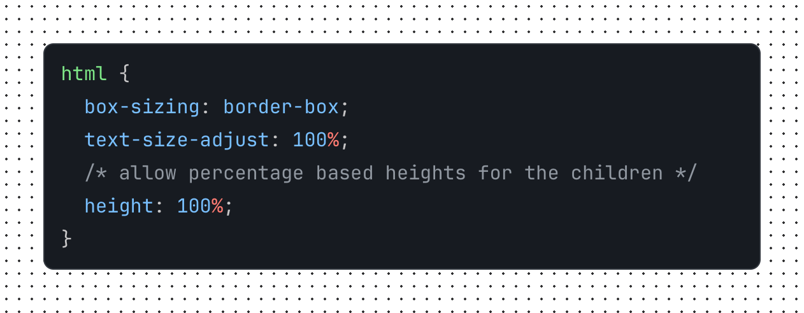
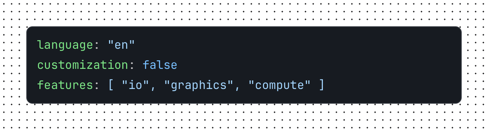
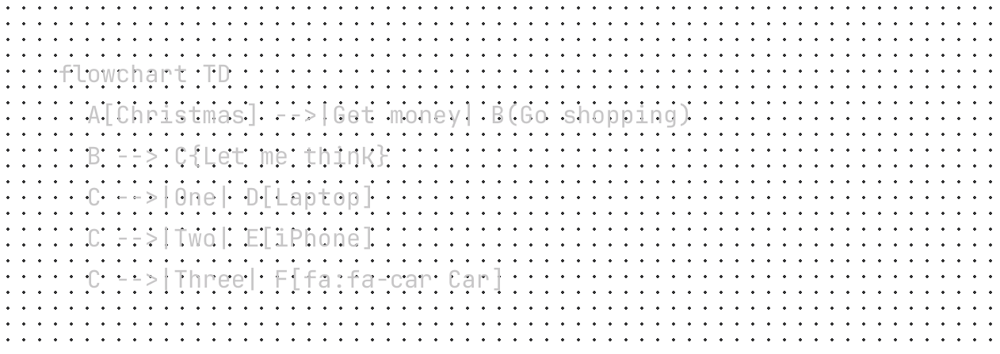
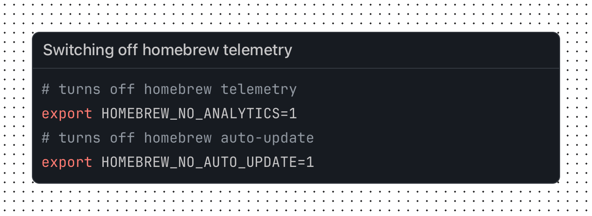
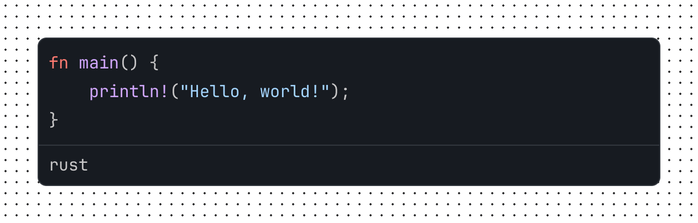
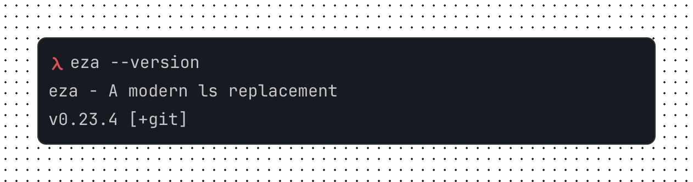
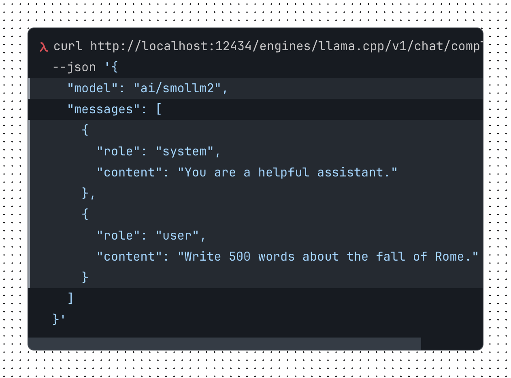
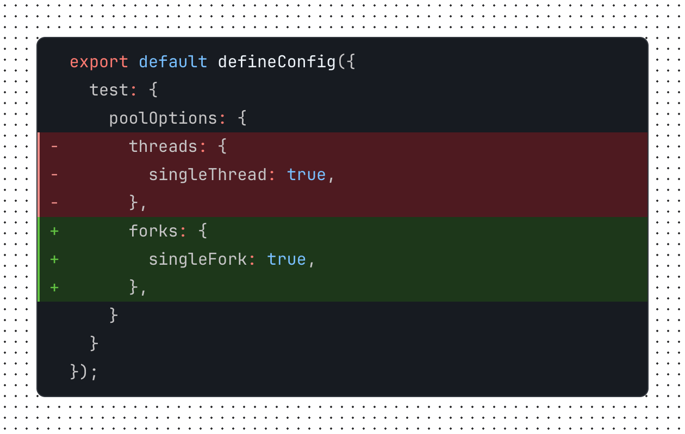

# rehype-starry-night

<!-- [](https://www.npmjs.com/package/@microflash/rehype-starry-night)
[](https://github.com/Microflash/rehype-starry-night/actions/workflows/regression.yml)
[](./LICENSE.md) -->

[rehype](https://github.com/rehypejs/rehype) plugin to highlight code with [`starry-night`](https://github.com/wooorm/starry-night)

- [What’s this?](#whats-this)
- [When should I use this?](#when-should-i-use-this)
- [Install](#install)
- [Use](#use)
- [API](#api)
	- [Plugin API](#plugin-api)
- [Theming](#theming)
	- [Supporting Light and Dark themes](#supporting-light-and-dark-themes)
- [Examples](#examples)
	- [Example: using aliases](#example-using-aliases)
	- [Example: using all `starry-night` grammars](#example-using-all-starry-night-grammars)
	- [Example: using custom `starry-night` grammar](#example-using-custom-starry-night-grammar)
	- [Example: skip highlighting a specific language](#example-skip-highlighting-a-specific-language)
	- [Example: show codeblock title](#example-show-codeblock-title)
	- [Example: show codeblock language](#example-show-codeblock-language)
	- [Example: show a prompt before a line](#example-show-a-prompt-before-a-line)
	- [Example: show highlighted, inserted and deleted lines](#example-show-highlighted-inserted-and-deleted-lines)
	- [Example: customize classname prefix](#example-customize-classname-prefix)
- [Related](#related)
- [License](#license)

## What’s this?

This package is a [unified](https://github.com/unifiedjs/unified) ([rehype](https://github.com/rehypejs/rehype)) plugin to highlight code with [`starry-night`](https://github.com/wooorm/starry-night) in a markdown document. It mimics GitHub's syntax highlighting.

## When should I use this?

This project is useful if you want to use the syntax highlighting powered by VS Code's syntax highlighter engine, and themes similar to GitHub. It is also useful if you want to build your own syntax highlighting themes based on [CSS custom properties](https://developer.mozilla.org/en-US/docs/Web/CSS/Using_CSS_custom_properties). You can enable additional features through plugins using [Plugin API](#plugin-api) based on your specific need; they are all opt-in.

## Install

This package is [ESM only](https://gist.github.com/sindresorhus/a39789f98801d908bbc7ff3ecc99d99c).

In Node.js (version 16.0+), install with [npm](https://docs.npmjs.com/cli/install):

```sh
npm install @microflash/rehype-starry-night
```

In Deno, with [esm.sh](https://esm.sh/):

```js
import rehypeStarryNight from "https://esm.sh/@microflash/rehype-starry-night";
```

In browsers, with [esm.sh](https://esm.sh/):

```html
<script type="module">
  import rehypeStarryNight from "https://esm.sh/@microflash/rehype-starry-night?bundle";
</script>
```

## Use

Say you have the following file `index.md`:

	```css
	html {
		box-sizing: border-box;
		text-size-adjust: 100%;
		/* allow percentage based heights for the children */
		height: 100%;
	}
	```

And our module `index.js` looks as follows:

```js
import { unified } from "unified";
import remarkParse from "remark-parse";
import remarkRehype from "remark-rehype";
import rehypeStringify from "rehype-stringify";
import rehypeStarryNight from "@microflash/rehype-starry-night";
import { readFileSync } from "node:fs";

main();

async function main() {
	const markdown = readFileSync("./index.md", "utf8");
	const file = await unified()
		.use(remarkParse)
		.use(remarkRehype, { allowDangerousHtml: true })
		.use(rehypeStarryNight)
		.use(rehypeStringify, { allowDangerousHtml: true })
		.process(markdown);

	console.log(String(file));
}
```

Running that with `node index.js` yields:

```html
<div class="hl">
<pre><code id="MC40OTU2MDAx" tabindex="0" class="language-css"><span class="pl-ent">html</span> {
	<span class="pl-c1">box-sizing</span>: <span class="pl-c1">border-box</span>;
	<span class="pl-c1">text-size-adjust</span>: <span class="pl-c1">100</span><span class="pl-k">%</span>;
	<span class="pl-c">/* allow percentage based heights for the children */</span>
	<span class="pl-c1">height</span>: <span class="pl-c1">100</span><span class="pl-k">%</span>;
}
</code></pre>
</div>
```



## API

The default export is `rehypeStarryNight`. The following options are available. All of them are optional.

- `namespace` (type: `string`, default: `hl`): class name of the highlighted codeblock
- `grammars` (type: `Array<Grammar>`, default: `common`) - [`starry-night`](https://github.com/wooorm/starry-night) compatible grammar definitions. By default, [common](https://github.com/wooorm/starry-night?tab=readme-ov-file#common) grammars provided by `starry-night` are used.
- `aliases` (type: `Record<string, string>`, default: `{}`): aliases to force syntax highlighting. By default, unknown languages are not highlighted.
- `plainText` (type: `Array<string>`, default: `[]`): array of languages not to highlight
- `plugins` (type: `Array<Plugin>`, default: `[]`) - array of plugins to customize the  highlighted codeblock, using [Plugin API](#plugin-api)
- `allowMissingScopes` (type: `boolean`, default: `false`) - whether to warn for missing scope or not

### Plugin API

You can customize the highlighted codeblock with a plugin. A plugin looks like this:

```js
export const myPlugin = {
	type: "header",
	opts: meta => {
		// parse codeblock metadata
		return {
			// plugin specific options
		}
	},
	apply: (opts, node) => {
		// do something with plugin specific options and codeblock node
	}
};
```

- `type` (type: `string`, possible values: `header`, `line` or `footer`) - controls whether the customization applies to the header, line or footer of the codeblock element
- `opts` (type: `function`, arguments: `meta`, return: `Object`) - optional option processing function. You can use this to read the metadata associated with a codeblock (parsed by [`fenceparser`](https://github.com/Microflash/fenceparser)) and return plugin specific options derived from them. By default, the metadata contains the language associated with the codeblock.
- `apply` (type: `function`, arguments: `opts` and `nodes`) - required function that applies customizations on the codeblock nodes (an array of [hast](https://github.com/syntax-tree/hastscript) nodes) based on plugin options (supplied by `opts` function)

`rehype-starry-night` ships a few plugins out of box, with which you can

- [add title to your codeblock](#example-show-codeblock-title)
- [show language of the codeblock](#example-show-codeblock-language)
- show [highlighted, inserted, and deleted](#example-show-highlighted-inserted-and-deleted-lines) lines
- [show a prompt before a line](#example-show-a-prompt-before-a-line) to indicate a command line prompt
- [mark lines as command output](#example-show-a-prompt-before-a-line) (so they are not copied alongwith command)

These plugins are opt-in and you'll have to manually import them.

```js
import {
	titlePlugin,
	languageIndicatorPlugin,
	lineAnnotationPlugin
} from "@microflash/rehype-starry-night/plugins";

const processor = await unified()
	.use(remarkParse)
	.use(remarkRehype, { allowDangerousHtml: true })
	.use(rehypeStarryNight, {
		plugins: [
			titlePlugin,
			languageIndicatorPlugin,
			lineAnnotationPlugin
		]
	})
	.use(rehypeStringify, { allowDangerousHtml: true });
```

Plugins are applied in the order they are added in options. In the above case, `titlePlugin` will be applied first followed by `languageIndicatorPlugin` and `lineAnnotationPlugin`.

## Theming

Import [`props.css`](./src/props.css) and [`index.css`](./src/index.css) files in your project, or use them as a base for your own custom theme. For different color schemes for syntax highlighting, check the [available themes on `starry-night` repository](https://github.com/wooorm/starry-night#css).

### Supporting Light and Dark themes

Here's one way to support light and dark themes; the appropriate theme will get activated based on system preferences.

```css
:root {
	/* light theme variables specific to rehype-starry-night plugin */
	--hl-bg-color: hsl(220, 23%, 97%);
	--hl-border-color: hsl(215, 15%, 85%);
	--hl-outline-color: hsl(215, 15%, 70%, 0.5);
}

@media (prefers-color-scheme: dark) {
	:root {
		/* dark theme variables specific to rehype-starry-night plugin */
		--hl-bg-color: hsl(216, 18%, 11%);
		--hl-border-color: hsl(215, 11%, 22%);
		--hl-outline-color: hsl(215, 11%, 37%, 0.5);
	}
}

/* import a `starry-night` theme that supports both dark and light themes */
@import "https://raw.githubusercontent.com/wooorm/starry-night/main/style/both.css";

/* import CSS specific to rehype-starry-night plugin */
@import "https://raw.githubusercontent.com/Microflash/rehype-starry-night/main/src/index.css";
```

> [!WARNING]
> URL imports for external styles is not recommended. You should either self-host them or bundle them.

## Examples

### Example: using aliases

Say you have the following file `index.md`:

	```xjm
	language: "en"
	customization: false
	features: [ "io", "graphics", "compute" ]
	```

You can alias `xjm` to `yml` as follows with `index.js`:

```js
import { unified } from "unified";
import remarkParse from "remark-parse";
import remarkRehype from "remark-rehype";
import rehypeStringify from "rehype-stringify";
import rehypeStarryNight from "@microflash/rehype-starry-night";
import { readFileSync } from "node:fs";

main();

async function main() {
	const markdown = readFileSync("./index.md", "utf8");
	const file = await unified()
		.use(remarkParse)
		.use(remarkRehype, { allowDangerousHtml: true })
		.use(rehypeStarryNight, {
			aliases: {
				xjm: "yml"
			}
		})
		.use(rehypeStringify, { allowDangerousHtml: true })
		.process(markdown);

	console.log(String(file));
}
```

Running this with `node index.js` yields:

```html
<div class="hl">
<pre><code id="MC40OTU1Mzcz" tabindex="0" class="language-xjm"><span class="pl-ent">language</span>: <span class="pl-s"><span class="pl-pds">"</span>en<span class="pl-pds">"</span></span>
<span class="pl-ent">customization</span>: <span class="pl-c1">false</span>
<span class="pl-ent">features</span>: <span class="pl-s">[ "io", "graphics", "compute" ]</span>
</code></pre>
</div>
```



### Example: using all `starry-night` grammars

By default, this plugin uses the [common](https://github.com/wooorm/starry-night?tab=readme-ov-file#common) grammars provided by `starry-night`. You can import [all](https://github.com/wooorm/starry-night?tab=readme-ov-file#all) grammars to highlight the code in languages not included in the common grammars.

Say, you have the following codeblock in `index.md`:

	```ballerina
	import ballerina/io;

	public function main() {
		io:println("Hello, World!");
	}
	```

Since, `ballerina` is not included in the common grammars, you'll have to import all grammars from the `starry-night` as follows in `index.js`:

```js
import { unified } from "unified";
import remarkParse from "remark-parse";
import remarkRehype from "remark-rehype";
import rehypeStringify from "rehype-stringify";
import rehypeStarryNight from "@microflash/rehype-starry-night";
import { all } from "@woorm/starry-night";
import { readFileSync } from "node:fs";

main();

async function main() {
	const markdown = readFileSync("./index.md", "utf8");
	const file = await unified()
		.use(remarkParse)
		.use(remarkRehype, { allowDangerousHtml: true })
		.use(rehypeStarryNight, {
			grammars: all
		})
		.use(rehypeStringify, { allowDangerousHtml: true })
		.process(markdown);

	console.log(String(file));
}
```

Running this with `node index.js` yields:

```html
<div class="hl">
<pre><code id="MC42MjYzNjU1" tabindex="0" class="language-ballerina"><span class="pl-k">import</span> <span class="pl-smi">ballerina</span>/<span class="pl-smi">io</span>;

<span class="pl-k">public</span> <span class="pl-k">function</span> <span class="pl-en">main</span>() {
	<span class="pl-smi">io</span><span class="pl-k">:</span><span class="pl-en">println</span>(<span class="pl-s"><span class="pl-pds">"</span>Hello, World!<span class="pl-pds">"</span></span>);
}
</code></pre>
</div>
```


### Example: using custom `starry-night` grammar

If you want to highlight a language for which `starry-night` does not provide a grammar, you can convert a Text Mate grammar to `starry-night` compatible format and use it alongside other grammar definitions.

Say, you have a custom grammar to highlight log files in `text.log.js` and you want to highlight the following file `index.md`:

	```log
	2025-05-18T23:08:48.269 INFO 10683 --- [main] com.zaxxer.hikari.HikariDataSource : H2HikariPool - Starting...
	2025-05-18T23:08:48.338 INFO 10683 --- [main] com.zaxxer.hikari.pool.HikariPool  : H2HikariPool - Added connection conn0: url=jdbc:h2:mem:sa user=SA
	2025-05-18T23:08:48.338 INFO 10683 --- [main] com.zaxxer.hikari.HikariDataSource : H2HikariPool - Start completed.
	```

You can import `text.log.js` alongside common grammars as follows in `index.js`:

```js
import { unified } from "unified";
import remarkParse from "remark-parse";
import remarkRehype from "remark-rehype";
import rehypeStringify from "rehype-stringify";
import rehypeStarryNight from "@microflash/rehype-starry-night";
import { common } from "@wooorm/starry-night";
import logGrammar from "./text.log.js";
import { readFileSync } from "node:fs";

main();

async function main() {
	const markdown = readFileSync("./index.md", "utf8");
	const file = await unified()
		.use(remarkParse)
		.use(remarkRehype, { allowDangerousHtml: true })
		.use(rehypeStarryNight, {
			grammars: [
				logGrammar,
				...common
			]
		})
		.use(rehypeStringify, { allowDangerousHtml: true })
		.process(markdown);

	console.log(String(file));
}
```

Running this with `node index.js` yields:

```html
<div class="hl">
<pre><code id="MC41ODc0NjE2" tabindex="0" class="language-log"><span class="pl-c">2025-05-18T23:08:48.269</span> <span class="pl-mi1">INFO</span> <span class="pl-c1">10683</span> --- [main] com.zaxxer.hikari.HikariDataSource : H2HikariPool - Starting...
<span class="pl-c">2025-05-18T23:08:48.338</span> <span class="pl-mi1">INFO</span> <span class="pl-c1">10683</span> --- [main] com.zaxxer.hikari.pool.HikariPool  : H2HikariPool - Added connection conn0: url=jdbc:h2:mem:sa user=SA
<span class="pl-c">2025-05-18T23:08:48.338</span> <span class="pl-mi1">INFO</span> <span class="pl-c1">10683</span> --- [main] com.zaxxer.hikari.HikariDataSource : H2HikariPool - Start completed.
</code></pre>
</div>
```


### Example: skip highlighting a specific language

In some cases, you may want to process codeblocks of a specific language differently. Say you have the following file `index.md` where you want to render the Mermaid diagram instead of syntax highlighting:

	```mermaid
	flowchart TD
		A[Christmas] -->|Get money| B(Go shopping)
		B --> C{Let me think}
		C -->|One| D[Laptop]
		C -->|Two| E[iPhone]
		C -->|Three| F[fa:fa-car Car]
	```

You can skip highlighting `mermaid` codeblock by listing it in `plainText` option as follows in the `index.js`:

```js
import { unified } from "unified";
import remarkParse from "remark-parse";
import remarkRehype from "remark-rehype";
import rehypeStringify from "rehype-stringify";
import rehypeStarryNight from "@microflash/rehype-starry-night";
import { readFileSync } from "node:fs";

main();

async function main() {
	const markdown = readFileSync("./index.md", "utf8");
	const file = await unified()
		.use(remarkParse)
		.use(remarkRehype, { allowDangerousHtml: true })
		.use(rehypeStarryNight, {
			plainText: [
				"mermaid"
			]
		})
		.use(rehypeStringify, { allowDangerousHtml: true })
		.process(markdown);

	console.log(String(file));
}
```

Running this with `node index.js` yields:

```html
<pre><code class="language-mermaid">flowchart TD
	A[Christmas] --&gt;|Get money| B(Go shopping)
	B --&gt; C{Let me think}
	C --&gt;|One| D[Laptop]
	C --&gt;|Two| E[iPhone]
	C --&gt;|Three| F[fa:fa-car Car]
</code></pre>
```



> [!NOTE]
> Codeblocks with unknown languages (that is, languages for which there are no available `starry-night` grammars) or no language are always skipped by the plugin. 

### Example: show codeblock title

You can add a title to a codeblock, like in the following file `index.md`:

	```zsh title="Switching off homebrew telemetry"
	# turns off homebrew telemetry
	export HOMEBREW_NO_ANALYTICS=1
	# turns off homebrew auto-update
	export HOMEBREW_NO_AUTO_UPDATE=1
	```

To show this title, import `title` plugin in `index.js` as follows:

```js
import { unified } from "unified";
import remarkParse from "remark-parse";
import remarkRehype from "remark-rehype";
import rehypeStringify from "rehype-stringify";
import rehypeStarryNight from "@microflash/rehype-starry-night";
import { titlePlugin } from "@microflash/rehype-starry-night/plugins";
import { readFileSync } from "node:fs";

main();

async function main() {
	const markdown = readFileSync("./index.md", "utf8");
	const file = await unified()
		.use(remarkParse)
		.use(remarkRehype, { allowDangerousHtml: true })
		.use(rehypeStarryNight, {
			plugins: [
				titlePlugin
			]
		})
		.use(rehypeStringify, { allowDangerousHtml: true })
		.process(markdown);

	console.log(String(file));
}
```

Running this with `node index.js` yields:

```html
<div class="hl">
	<div class="hl-header">
		<div class="hl-title">Switching off homebrew telemetry</div>
	</div>
<pre><code id="MC41NTAxMDgw" tabindex="0" class="language-zsh"><span class="pl-c"># turns off homebrew telemetry</span>
<span class="pl-k">export</span> HOMEBREW_NO_ANALYTICS=1
<span class="pl-c"># turns off homebrew auto-update</span>
<span class="pl-k">export</span> HOMEBREW_NO_AUTO_UPDATE=1
</code></pre>
</div>
```



### Example: show codeblock language

Say, you have the following file `index.md`:

	```rust
	fn main() {
	    println!("Hello, world!");
	}
	```

To display the language associated with this codeblock, import `languageIndicator` plugin in the `index.js` as follows:

```js
import { unified } from "unified";
import remarkParse from "remark-parse";
import remarkRehype from "remark-rehype";
import rehypeStringify from "rehype-stringify";
import rehypeStarryNight from "@microflash/rehype-starry-night";
import { languageIndicatorPlugin } from "@microflash/rehype-starry-night/plugins";
import { readFileSync } from "node:fs";

main();

async function main() {
	const markdown = readFileSync("./index.md", "utf8");
	const file = await unified()
		.use(remarkParse)
		.use(remarkRehype, { allowDangerousHtml: true })
		.use(rehypeStarryNight, {
			plugins: [
				languageIndicatorPlugin
			]
		})
		.use(rehypeStringify, { allowDangerousHtml: true })
		.process(markdown);

	console.log(String(file));
}
```

Running this with `node index.js` yields:

```html
<div class="hl">
<pre><code id="MC4yMTUwNTAx" tabindex="0" class="language-rust"><span class="pl-k">fn</span> <span class="pl-en">main</span>() {
    <span class="pl-en">println!</span>(<span class="pl-s"><span class="pl-pds">"</span>Hello, world!<span class="pl-pds">"</span></span>);
}
</code></pre>
	<div class="hl-footer">
		<div class="hl-language">rust</div>
	</div>
</div>
```



### Example: show a prompt before a line

Sometime you may want to display a command and its output. You can specify lines that are command-line instructions and lines that are output, as follows in `index.md`:

	```sh prompt{1} output{2..4}
	eza --version
	eza - A modern ls replacement
	v0.23.4 [+git]
	```

Import `lineAnnotation` plugin in the `index.js` as follows:

```js
import { unified } from "unified";
import remarkParse from "remark-parse";
import remarkRehype from "remark-rehype";
import rehypeStringify from "rehype-stringify";
import rehypeStarryNight from "@microflash/rehype-starry-night";
import { lineAnnotationPlugin } from "@microflash/rehype-starry-night/plugins";
import { readFileSync } from "node:fs";

main();

async function main() {
	const markdown = readFileSync("./index.md", "utf8");
	const file = await unified()
		.use(remarkParse)
		.use(remarkRehype, { allowDangerousHtml: true })
		.use(rehypeStarryNight, {
			plugins: [
				lineAnnotationPlugin
			]
		})
		.use(rehypeStringify, { allowDangerousHtml: true })
		.process(markdown);

	console.log(String(file));
}
```

Running this with `node index.js` yields:

```html
<div class="hl">
<pre><code id="MC4wMDU4OTIz" tabindex="0" class="language-sh" style="--hl-line-gutter: 1"><span data-line-number="1"><span class="prompt" aria-hidden="true"></span>eza --version</span>
<span data-line-number="2" data-line-output="">eza - A modern ls replacement</span>
<span data-line-number="3" data-line-output="">v0.23.4 [+git]</span>
</code></pre>
</div>
```



> [!NOTE]
> The selection of prompt character should be disabled so that when people copy the command, the prompt is not copied. This behavior is implemented in [`index.css`](./src/index.css) with `user-select: none`. Similarly, the output is also disabled for user selection because you usually want people to just copy the command and not the output.

### Example: show highlighted, inserted and deleted lines

You can highlight lines by specifying the line numbers (or even, range of line numbers) between curly braces in the codeblock metadata.

	```sh {3,5..12} prompt{1}
	curl http://localhost:12434/engines/llama.cpp/v1/chat/completions \
		--json '{
			"model": "ai/smollm2",
			"messages": [
				{
					"role": "system",
					"content": "You are a helpful assistant."
				},
				{
					"role": "user",
					"content": "Write 500 words about the fall of Rome."
				}
			]
		}'
	```

Import `lineAnnotation` plugin (described [in the previous example](#example-show-a-prompt-before-a-line)) and run `node index.js` which yields:

```html
<div class="hl">
<pre><code id="MC43MzU2Njkz" tabindex="0" class="language-sh" style="--hl-line-gutter: 2"><span data-line-number="1"><span class="prompt" aria-hidden="true"></span>curl http://localhost:12434/engines/llama.cpp/v1/chat/completions \</span>
<span data-line-number="2">	--json <span class="pl-s"><span class="pl-pds">'</span>{</span></span>
<span data-line-number="3" data-line-marked=""><span class="pl-s">		"model": "ai/smollm2",</span></span>
<span data-line-number="4"><span class="pl-s">		"messages": [</span></span>
<span data-line-number="5" data-line-marked=""><span class="pl-s">			{</span></span>
<span data-line-number="6" data-line-marked=""><span class="pl-s">				"role": "system",</span></span>
<span data-line-number="7" data-line-marked=""><span class="pl-s">				"content": "You are a helpful assistant."</span></span>
<span data-line-number="8" data-line-marked=""><span class="pl-s">			},</span></span>
<span data-line-number="9" data-line-marked=""><span class="pl-s">			{</span></span>
<span data-line-number="10" data-line-marked=""><span class="pl-s">				"role": "user",</span></span>
<span data-line-number="11" data-line-marked=""><span class="pl-s">				"content": "Write 500 words about the fall of Rome."</span></span>
<span data-line-number="12" data-line-marked=""><span class="pl-s">			}</span></span>
<span data-line-number="13"><span class="pl-s">		]</span></span>
<span data-line-number="14"><span class="pl-s">	}<span class="pl-pds">'</span></span></span>
</code></pre>
</div>
```



Similarly, you can render inserted and deleted lines using `ins` and `del` properties on the codeblock followed by a range of line numbers.

	```js title="Pool options in Vitest 2.0" del{4..6} ins{7..9}
	export default defineConfig({
	  test: {
	    poolOptions: {
	      threads: {
	        singleThread: true,
	      },
	      forks: {
	        singleFork: true,
	      },
	    }
	  }
	});
	```

The above codeblock gets rendered as:

```html
<div class="hl">
<pre><code id="MC4wNDgyMzEx" tabindex="0" class="language-js" style="--hl-line-gutter: 2"><span data-line-number="1"><span class="diff">	</span><span class="pl-k">export</span> <span class="pl-c1">default</span> <span class="pl-smi">defineConfig</span>({</span>
<span data-line-number="2"><span class="diff">	</span>	test<span class="pl-k">:</span> {</span>
<span data-line-number="3"><span class="diff">	</span>		poolOptions<span class="pl-k">:</span> {</span>
<span data-line-number="4" data-line-deleted=""><span class="diff">-	</span>			threads<span class="pl-k">:</span> {</span>
<span data-line-number="5" data-line-deleted=""><span class="diff">-	</span>				singleThread<span class="pl-k">:</span> <span class="pl-c1">true</span>,</span>
<span data-line-number="6" data-line-deleted=""><span class="diff">-	</span>			},</span>
<span data-line-number="7" data-line-inserted=""><span class="diff">+	</span>			forks<span class="pl-k">:</span> {</span>
<span data-line-number="8" data-line-inserted=""><span class="diff">+	</span>				singleFork<span class="pl-k">:</span> <span class="pl-c1">true</span>,</span>
<span data-line-number="9" data-line-inserted=""><span class="diff">+	</span>			},</span>
<span data-line-number="10"><span class="diff">	</span>		}</span>
<span data-line-number="11"><span class="diff">	</span>	}</span>
<span data-line-number="12"><span class="diff">	</span>});</span>
</code></pre>
</div>
```



> [!NOTE]
> See the documentation of [`fenceparser`](https://github.com/Microflash/fenceparser) to learn about the ways in which you can specify the line range.

### Example: customize classname prefix

Say you have the following file `index.md`:

	```java
	IO.println("Hello, world!");
	```

You can customize the classname prefix of codeblock element by setting the `namespace` option, as follows with `index.js`:

```js
import { unified } from "unified";
import remarkParse from "remark-parse";
import remarkRehype from "remark-rehype";
import rehypeStringify from "rehype-stringify";
import rehypeStarryNight from "@microflash/rehype-starry-night";
import { readFileSync } from "node:fs";

main();

async function main() {
	const markdown = readFileSync("./index.md", "utf8");
	const file = await unified()
		.use(remarkParse)
		.use(remarkRehype, { allowDangerousHtml: true })
		.use(rehypeStarryNight, {
			namespace: "highlight"
		})
		.use(rehypeStringify, { allowDangerousHtml: true })
		.process(markdown);

	console.log(String(file));
}
```

Running this with `node index.js` yields:

```html
<div class="highlight">
<pre><code id="MC45MjYyOTEy" tabindex="0" class="language-java"><span class="pl-c1">IO</span><span class="pl-k">.</span>println(<span class="pl-s"><span class="pl-pds">"</span>Hello, world!<span class="pl-pds">"</span></span>);
</code></pre>
</div>
```

## Related

- [`rehype-starry-night`](https://github.com/rehypejs/rehype-starry-night) &mdash; alternative plugin to apply syntax highlighting to code with `starry-night`
- [`rehype-highlight`](https://github.com/rehypejs/rehype-highlight) &mdash; highlight code with [highlight.js](https://github.com/isagalaev/highlight.js) (through [lowlight](https://github.com/wooorm/lowlight))
- [`rehype-prism-plus`](https://github.com/timlrx/rehype-prism-plus) &mdash; highlight code with [Prism](http://prismjs.com) (via [refractor](https://github.com/wooorm/refractor)) with additional line highlighting and line numbers functionalities
- [`@shikijs/rehype`](https://github.com/shikijs/shiki/tree/main/packages/rehype) &mdash; highlight code with [shiki](https://shiki.style)

## License

[MIT](./LICENSE.md)
