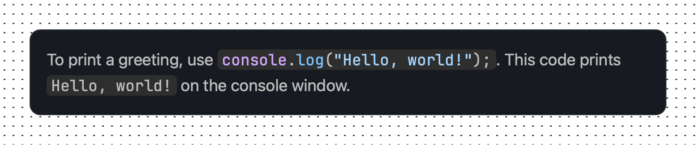
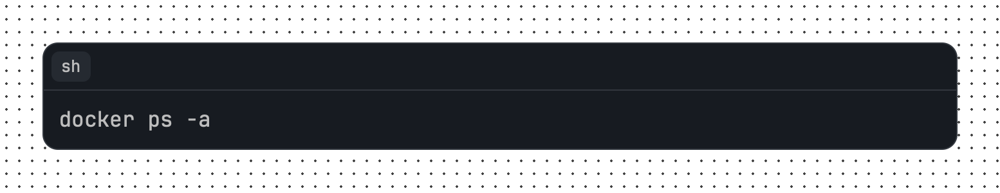
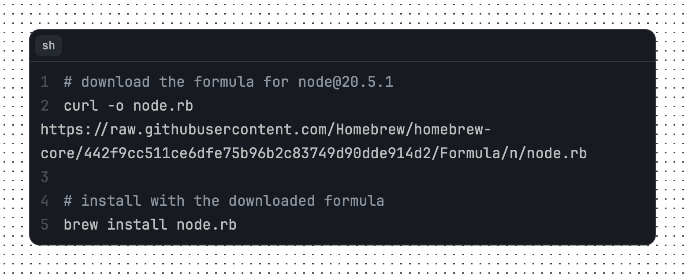

# rehype-starry-night

[](https://www.npmjs.com/package/@microflash/rehype-starry-night)
[](https://github.com/Microflash/rehype-starry-night/actions/workflows/regression.yml)
[](./LICENSE.md)

[rehype](https://github.com/rehypejs/rehype) plugin to highlight code with [Starry Night](https://github.com/wooorm/starry-night)

- [What’s this?](#whats-this)
- [When should I use this?](#when-should-i-use-this)
- [Install](#install)
- [Use](#use)
	- [Support for inline `code` elements](#support-for-inline-code-elements)
- [API](#api)
	- [Plugin API for `rehype-starry-night`](#plugin-api-for-rehype-starry-night)
	- [API for `rehype-starry-night-inline`](#api-for-rehype-starry-night-inline)
	- [API for `remark-inline-code-lang`](#api-for-remark-inline-code-lang)
- [Theming](#theming)
	- [Supporting Light and Dark themes](#supporting-light-and-dark-themes)
- [Examples](#examples)
	- [Example: Codeblock with single line](#example-codeblock-with-single-line)
	- [Example: Codeblock with multiple lines](#example-codeblock-with-multiple-lines)
	- [Example: Codeblock with title](#example-codeblock-with-title)
	- [Example: Codeblock with prompts](#example-codeblock-with-prompts)
	- [Example: Codeblock with wrapped lines](#example-codeblock-with-wrapped-lines)
	- [Example: Codeblock with highlighted lines](#example-codeblock-with-highlighted-lines)
	- [Example: Codeblock with added and removed lines](#example-codeblock-with-added-and-removed-lines)
	- [Example: aliases](#example-aliases)
	- [Example: custom header extension](#example-custom-header-extension)
	- [Example: custom classname prefix](#example-custom-classname-prefix)
	- [Example: custom marker](#example-custom-marker)
- [Related](#related)
- [License](#license)

## What’s this?

This package is a [unified](https://github.com/unifiedjs/unified) ([rehype](https://github.com/rehypejs/rehype)) plugin to highlight code with [Starry Night](https://github.com/wooorm/starry-night) in a markdown document. It mimics GitHub's syntax highlighting.

## When should I use this?

This project is useful if you want to use the syntax highlighting powered by VS Code's syntax highlighter engine, and themes similar to GitHub. It is also useful if you want to build your own syntax highlighting themes based on [CSS custom properties](https://developer.mozilla.org/en-US/docs/Web/CSS/Using_CSS_custom_properties).

The following additonal features are also available out of box:

- line numbers
- line highlights
- annotations for added and removed lines
- conditionally wrapping lines
- prompt character
- title and language information
- highlighting inline `code` elements

## Install

This package is [ESM only](https://gist.github.com/sindresorhus/a39789f98801d908bbc7ff3ecc99d99c).

In Node.js (version 16.0+), install with [npm](https://docs.npmjs.com/cli/install):

```sh
npm install @microflash/rehype-starry-night
```

In Deno, with [esm.sh](https://esm.sh/):

```js
import rehypeStarryNight from "https://esm.sh/@microflash/rehype-starry-night";
```

In browsers, with [esm.sh](https://esm.sh/):

```html
<script type="module">
  import rehypeStarryNight from "https://esm.sh/@microflash/rehype-starry-night?bundle";
</script>
```

## Use

Say we have the following file `example.md`:

	```css
	html {
	  box-sizing: border-box;
	  text-size-adjust: 100%;
	  /* allow percentage based heights for the children */
	  height: 100%;
	}
	```

And our module `example.js` looks as follows:

```js
import { unified } from "unified";
import remarkParse from "remark-parse";
import remarkRehype from "remark-rehype";
import rehypeStringify from "rehype-stringify";
import rehypeStarryNight from "@microflash/rehype-starry-night";

main();

async function main() {
  const file = await unified()
    .use(remarkParse)
    .use(remarkRehype, { allowDangerousHtml: true })
    .use(rehypeStarryNight)
    .use(rehypeStringify, { allowDangerousHtml: true })
    .process(markdown);

  console.log(String(file));
}
```

Running that with `node example.js` yields:

```html
<div class="hl hl-css">
  <div class="hl-header">
    <div class="hl-language">css</div>
  </div>
<pre id="MC4wNTYxMTQ4" style="--hl-line-number-gutter-factor: 1"><code tabindex="0"><span class="line"><span class="line-number" aria-hidden="true">1</span><span class="pl-ent">html</span> {</span>
<span class="line"><span class="line-number" aria-hidden="true">2</span>  <span class="pl-c1">box-sizing</span>: <span class="pl-c1">border-box</span>;</span>
<span class="line"><span class="line-number" aria-hidden="true">3</span>  <span class="pl-c1">text-size-adjust</span>: <span class="pl-c1">100</span><span class="pl-k">%</span>;</span>
<span class="line"><span class="line-number" aria-hidden="true">4</span>  <span class="pl-c">/* allow percentage based heights for the children */</span></span>
<span class="line"><span class="line-number" aria-hidden="true">5</span>  <span class="pl-c1">height</span>: <span class="pl-c1">100</span><span class="pl-k">%</span>;</span>
<span class="line"><span class="line-number" aria-hidden="true">6</span>}</span>
</code></pre>
</div>
```


### Support for inline `code` elements

To highlight inline `code` elements, import [`rehype-starry-night-inline`](./src/rehype-starry-night-inline/index.js) plugin. This plugin relies on the language information injected by the [`remark-inline-code-lang`](./src/remark-inline-code-lang/index.js) plugin.

Say we have the following file `example.md`:

```md
To print a greeting, use `js> console.log("Hello, world!");`. This code prints `Hello, world!` on the console window.
```

And our module `example.js` looks as follows:

```js
import { unified } from "unified";
import remarkParse from "remark-parse";
import remarkInlineCodeLang from "@microflash/rehype-starry-night/remark-inline-code-lang";
import remarkRehype from "remark-rehype";
import rehypeStringify from "rehype-stringify";
import rehypeStarryNightInline from "@microflash/rehype-starry-night/rehype-starry-night-inline";

main();

async function main() {
  const file = await unified()
    .use(remarkParse)
    .use(remarkInlineCodeLang)
    .use(remarkRehype, { allowDangerousHtml: true })
    .use(rehypeStarryNightInline)
    .use(rehypeStringify, { allowDangerousHtml: true })
    .process(markdown);

  console.log(String(file));
}
```

Running that with `node example.js` yields:

```html
<p>To print a greeting, use <code class="hl-inline hl-js"><span class="pl-en">console</span>.<span class="pl-c1">log</span>(<span class="pl-s"><span class="pl-pds">"</span>Hello, world!<span class="pl-pds">"</span></span>);</code>. This code prints <code>Hello, world!</code> on the console window.</p>
```



## API

The default export is `rehypeStarryNight`. The following options are available. All of them are optional.

- `aliases` (type: `Object`) - used to alias languages to force syntax highlighting. By default, unknown languages are highlighted as plain text.
- `grammars` (type: `Array<Grammar>`) - array of [Starry Night](https://github.com/wooorm/starry-night) compatible grammar definitions. By default, all grammars provided by Starry Night are used.
- `classNamePrefix` (type: `string`, default: `hl`) - prefix of the classNames for different elements of HTML generated by the plugin.
- `plugins` (type: `Array<Plugin>`, default: [`defaultPluginPack`](./src/rehype-starry-night/index.js#L20)) - a list of plugins to customize the header and lines.

### Plugin API for `rehype-starry-night`

`rehype-starry-night` supports two types of plugins: _header plugins_ that modify the header items, and _line plugins_ that modify the lines of code.

```js
// structure of a plugin
export default {
  type: "header", // or "line"
  plugin: function (globalOptions, nodes) {
    // do something with `globalOptions` and `nodes`
  }
}
```

- `type` (type: `string`) - declares whether the plugin is a header or line plugin using `header` or `line` value.
- `globalOptions` (type: `Object`) - contains the configuration available to a plugin, such as
  - `id` (type: `string`) - unique id attached to the `pre` element
  - `metadata` (type: `Object`) - configuration specified on the codeblock, parsed with [`fenceparser`](https://github.com/Microflash/fenceparser)
  - `language` (type: `string`) - language specified on the codeblock after backticks
  - `classNamePrefix` (type: `string`, default: `hl`) - prefix of the classNames for different elements of HTML generated by the plugin
- `nodes` (type: `Array<Node>`) - array of [hast](https://github.com/syntax-tree/hastscript) nodes. For header plugins, it is the array of children of the header. For line plugins, it is the array of the lines of code in the codeblock.

`rehype-starry-night` ships with the following plugins out of box.

- [`headerLanguagePlugin`](./src/rehype-starry-night/plugins/header-language-plugin.js) - attaches the language in the header
- [`headerTitlePlugin`](./src/rehype-starry-night/plugins/header-title-plugin.js) - attaches a title in the header if specified on the codeblock
- [`linePromptPlugin`](./src/rehype-starry-night/plugins/line-prompt-plugin.js) - used to add a prompt symbol before the start of a line
- [`lineMarkPlugin`](./src/rehype-starry-night/plugins/line-mark-plugin.js) - used to highlight a line
- [`lineInsPlugin`](./src/rehype-starry-night/plugins/line-ins-plugin.js) - used to annotate an added line
- [`lineDelPlugin`](./src/rehype-starry-night/plugins/line-del-plugin.js) - used to annotate a removed line

### API for `rehype-starry-night-inline`

The following options are available for the `rehype-starry-night-inline` plugin. All of them are optional.

- `aliases` (type: `Object`) - used to alias languages to force syntax highlighting. By default, unknown languages are highlighted as plain text.
- `grammars` (type: `Array<Grammar>`): array of [Starry Night](https://github.com/wooorm/starry-night) compatible grammar definitions. By default, all grammars provided by Starry Night are used.
- `classNamePrefix` (type: `string`, default: `hl`): prefix of the classNames for different elements of HTML generated by the plugin.

### API for `remark-inline-code-lang`

The following options are available for the `remark-inline-code-lang` plugin. All of them are optional.

- `marker` (type: `string`, default: `> `) - the marker for inline `code` element before which the language information is specified.

## Theming

Import [`props.css`](./src/props.css) and [`index.css`](./src/index.css) files in your project, or use them as a base for your own custom theme. For different color schemes for syntax highlighting, check the [available themes on Starry Night repository](https://github.com/wooorm/starry-night#css).

### Supporting Light and Dark themes

Here's one way to support light and dark themes; the appropriate theme will get activated based on system preferences.

```css
:root {
  /* light theme variables specific to rehype-starry-night plugin */
  --hl-background-color: hsl(220, 23%, 97%);
  --hl-background-color-inline: var(--hl-background-color);
  --hl-border-color: hsl(215, 15%, 85%);
  --hl-outline-color: hsl(215, 15%, 70%, 0.5);
  --hl-line-highlight-background-color: hsl(220, 23%, 92%);
  --hl-line-added-background-color: hsla(103, 96%, 73%, 0.5);
  --hl-line-removed-background-color: hsla(4, 75%, 83%, 0.5);
  --hl-line-active-background-color: hsl(220, 23%, 89%);
  --hl-line-number-added-color: hsl(106, 59%, 27%);
  --hl-line-number-removed-color: hsl(355, 67%, 41%);
}

@media (prefers-color-scheme: dark) {
  :root {
    /* dark theme variables specific to rehype-starry-night plugin */
    --hl-background-color: hsl(216, 18%, 11%);
    --hl-border-color: hsl(215, 11%, 22%);
    --hl-outline-color: hsl(215, 11%, 37%, 0.5);
    --hl-line-highlight-background-color: hsl(218, 14%, 17%);
    --hl-line-added-background-color: hsla(105, 62%, 20%, 0.5);
    --hl-line-removed-background-color: hsla(356, 69%, 31%, 0.5);
    --hl-line-active-background-color: hsl(218, 14%, 20%);
    --hl-line-number-added-color: hsl(105, 51%, 51%);
    --hl-line-number-removed-color: hsl(3, 77%, 74%);
  }
}

/* import a Starry Night theme that supports both dark and light themes */
@import "https://raw.githubusercontent.com/wooorm/starry-night/main/style/both.css";

/* import CSS specific to rehype-starry-night plugin */
@import "https://raw.githubusercontent.com/Microflash/rehype-starry-night/main/src/index.css";
```

> [!WARNING]
> URL imports for external styles is not recommended. You should either self-host them, bundle them, or copy-paste the entire CSS in one single file.

## Examples

### Example: Codeblock with single line

	```sh
	docker ps -a
	```

The above codeblock gets rendered as:

```html
<div class="hl hl-sh">
  <div class="hl-header">
    <div class="hl-language">sh</div>
  </div>
<pre id="MC4wNjE2ODk0"><code tabindex="0"><span class="line">docker ps -a</span>
</code></pre>
</div>
```



The plugin does not add line numbers when the codeblock contains a single line.

### Example: Codeblock with multiple lines

	```css
	* {
	  display: revert;
	}
	```

The above codeblock gets rendered as:

```html
<div class="hl hl-css">
  <div class="hl-header">
    <div class="hl-language">css</div>
  </div>
<pre id="MC4xNzU3MDU0" style="--hl-line-number-gutter-factor: 1"><code tabindex="0"><span class="line"><span class="line-number" aria-hidden="true">1</span><span class="pl-ent">*</span> {</span>
<span class="line"><span class="line-number" aria-hidden="true">2</span>  <span class="pl-c1">display</span>: <span class="pl-c1">revert</span>;</span>
<span class="line"><span class="line-number" aria-hidden="true">3</span>}</span>
</code></pre>
</div>
```


The plugin attaches `--hl-line-number-gutter-factor` CSS property on the `pre` element when the codeblock contains multiple lines. You can use this property to pad the line numbers and align them. See [`index.css`](./src/index.css#L73).

### Example: Codeblock with title

	```zsh title="Switching off homebrew telemetry"
	# turns off homebrew telemetry
	export HOMEBREW_NO_ANALYTICS=1
	# turns off homebrew auto-update
	export HOMEBREW_NO_AUTO_UPDATE=1
	```

The above codeblock gets rendered as:

```html
<div class="hl hl-zsh">
  <div class="hl-header">
    <div class="hl-language">zsh</div>
    <div class="hl-title">Switching off homebrew telemetry</div>
  </div>
<pre id="MC4xOTE1OTM1" style="--hl-line-number-gutter-factor: 1"><code tabindex="0"><span class="line"><span class="line-number" aria-hidden="true">1</span><span class="pl-c"># turns off homebrew telemetry</span></span>
<span class="line"><span class="line-number" aria-hidden="true">2</span><span class="pl-k">export</span> HOMEBREW_NO_ANALYTICS=1</span>
<span class="line"><span class="line-number" aria-hidden="true">3</span><span class="pl-c"># turns off homebrew auto-update</span></span>
<span class="line"><span class="line-number" aria-hidden="true">4</span><span class="pl-k">export</span> HOMEBREW_NO_AUTO_UPDATE=1</span>
</code></pre>
</div>
```


### Example: Codeblock with prompts

Sometimes you may want to show a prompt character while displaying a command-line instruction. `rehype-starry-night` supports this out of box.

	```sh prompt{1,3}
	curl localhost:8080/actuator/health
	{"status":"UP"}
	curl localhost:8080/greeter?name=Anya
	Hello, Anya!
	```

The above codeblock gets rendered as:

```html
<div class="hl hl-sh">
  <div class="hl-header">
    <div class="hl-language">sh</div>
  </div>
<pre id="MC43MTQzMTQx" style="--hl-line-number-gutter-factor: 1"><code tabindex="0"><span class="line"><span class="line-number" aria-hidden="true">1</span><span class="line-prompt" aria-hidden="true"></span>curl localhost:8080/actuator/health</span>
<span class="line"><span class="line-number" aria-hidden="true">2</span>{<span class="pl-s"><span class="pl-pds">"</span>status<span class="pl-pds">"</span></span>:<span class="pl-s"><span class="pl-pds">"</span>UP<span class="pl-pds">"</span></span>}</span>
<span class="line"><span class="line-number" aria-hidden="true">3</span><span class="line-prompt" aria-hidden="true"></span>curl localhost:8080/greeter<span class="pl-k">?</span>name=Anya</span>
<span class="line"><span class="line-number" aria-hidden="true">4</span>Hello, Anya<span class="pl-k">!</span></span>
</code></pre>
</div>
```


You should disable the selection of prompt character so that when people copy the command, the prompt is not copied. See [`index.css`](./src/index.css#L166).

### Example: Codeblock with wrapped lines

Sometimes you may want to avoid scrolling a long line containing important information at the very end. In such cases, you can wrap the codeblock with `wrap="true"` property.

	```sh wrap="true"
	# download the formula for node@20.5.1
	curl -o node.rb https://raw.githubusercontent.com/Homebrew/homebrew-core/442f9cc511ce6dfe75b96b2c83749d90dde914d2/Formula/n/node.rb

	# install with the downloaded formula
	brew install node.rb
	```

The above codeblock gets rendered as:

```html
<div class="hl hl-sh">
  <div class="hl-header">
    <div class="hl-language">sh</div>
  </div>
<pre id="MC41OTIxMDEz" style="--hl-line-number-gutter-factor: 1" data-pre-wrap=""><code tabindex="0"><span class="line"><span class="line-number" aria-hidden="true">1</span><span class="pl-c"># download the formula for node@20.5.1</span></span>
<span class="line"><span class="line-number" aria-hidden="true">2</span>curl -o node.rb https://raw.githubusercontent.com/Homebrew/homebrew-core/442f9cc511ce6dfe75b96b2c83749d90dde914d2/Formula/n/node.rb</span>
<span class="line"><span class="line-number" aria-hidden="true">3</span></span>
<span class="line"><span class="line-number" aria-hidden="true">4</span><span class="pl-c"># install with the downloaded formula</span></span>
<span class="line"><span class="line-number" aria-hidden="true">5</span>brew install node.rb</span>
</code></pre>
</div>
```



When you set `wrap="true"`, the plugin attaches a `[data-pre-wrap]` attribute on the `pre` element. You can use CSS to set `white-space: pre-wrap` on the `code` element to enable wrapping. See [`index.css`](./src/index.css#L68).

### Example: Codeblock with highlighted lines

You can highlight lines by specifying the line numbers (or even, range of line numbers) between curly braces in the codeblock metadata.

	```sh {4..7} prompt{1}
	aws --endpoint-url http://localhost:4566 s3api list-buckets
	{
	  "Buckets": [
	    {
	      "Name": "my-bucket",
	      "CreationDate": "2022-07-12T13:44:44+00:00"
	    }
	  ],
	  "Owner": {
	    "DisplayName": "webfile",
	    "ID": "bcaf1ffd86f41161ca5fb16fd081034f"
	  }
	}
	```

The above codeblock gets rendered as:

```html
<div class="hl hl-sh">
  <div class="hl-header">
    <div class="hl-language">sh</div>
  </div>
<pre id="MC4wNTg1MTA5" style="--hl-line-number-gutter-factor: 2"><code tabindex="0"><span class="line"><span class="line-number" aria-hidden="true">1</span><span class="line-prompt" aria-hidden="true"></span>aws --endpoint-url http://localhost:4566 s3api list-buckets</span>
<span class="line"><span class="line-number" aria-hidden="true">2</span>{</span>
<span class="line"><span class="line-number" aria-hidden="true">3</span>	<span class="pl-s"><span class="pl-pds">"</span>Buckets<span class="pl-pds">"</span></span>: [</span>
<span class="line" data-highlighted=""><span class="line-number" aria-hidden="true">4</span>		{</span>
<span class="line" data-highlighted=""><span class="line-number" aria-hidden="true">5</span>			<span class="pl-s"><span class="pl-pds">"</span>Name<span class="pl-pds">"</span></span>: <span class="pl-s"><span class="pl-pds">"</span>my-bucket<span class="pl-pds">"</span></span>,</span>
<span class="line" data-highlighted=""><span class="line-number" aria-hidden="true">6</span>			<span class="pl-s"><span class="pl-pds">"</span>CreationDate<span class="pl-pds">"</span></span>: <span class="pl-s"><span class="pl-pds">"</span>2022-07-12T13:44:44+00:00<span class="pl-pds">"</span></span></span>
<span class="line" data-highlighted=""><span class="line-number" aria-hidden="true">7</span>		}</span>
<span class="line"><span class="line-number" aria-hidden="true">8</span>	],</span>
<span class="line"><span class="line-number" aria-hidden="true">9</span>	<span class="pl-s"><span class="pl-pds">"</span>Owner<span class="pl-pds">"</span></span>: {</span>
<span class="line"><span class="line-number" aria-hidden="true">10</span>		<span class="pl-s"><span class="pl-pds">"</span>DisplayName<span class="pl-pds">"</span></span>: <span class="pl-s"><span class="pl-pds">"</span>webfile<span class="pl-pds">"</span></span>,</span>
<span class="line"><span class="line-number" aria-hidden="true">11</span>		<span class="pl-s"><span class="pl-pds">"</span>ID<span class="pl-pds">"</span></span>: <span class="pl-s"><span class="pl-pds">"</span>bcaf1ffd86f41161ca5fb16fd081034f<span class="pl-pds">"</span></span></span>
<span class="line"><span class="line-number" aria-hidden="true">12</span>	}</span>
<span class="line"><span class="line-number" aria-hidden="true">13</span>}</span>
</code></pre>
</div>
```


See the documentation of [`fenceparser`](https://github.com/Microflash/fenceparser) to learn about the ways in which you can specify the line range for highlighted lines.

### Example: Codeblock with added and removed lines

You can render code diffs using `ins` and `del` properties on the codeblock followed by a range of line numbers.

	```svg del{2..7} ins{8..10}
	<svg width="800px" height="800px" viewBox="0 0 400 400" xmlns="http://www.w3.org/2000/svg" fill="none" stroke="#000" stroke-width="8" stroke-linecap="round" stroke-linejoin="round">
	  <path d="M52.4172 129.945C154.767 124.431 299.051 80.9206 362.913 182.602C369.254 192.695 372.11 221.082 363.911 231.283C340.825 260.002 85.1022 258.994 38.4434 258.994"/>
	  <path d="M371.656 279.262C260.686 278.71 142.19 286.441 33.0469 281.78"/>
	  <path d="M264.29 133.538C247.656 199.764 297.805 187.344 346.025 180.575"/>
	  <path d="M240.21 132.188C251.965 213.876 84.6787 176.294 29 190.197"/>
	  <path d="M171.274 140.283C166.221 155.378 170.086 170.931 170.086 186.15"/>
	  <path d="M96.7925 144.33C93.1231 154.511 95.5446 187.149 95.6053 187.499"/>
	  <path d="M52.417 129.945c102.35-5.514 246.634-49.024 310.496 52.657 6.341 10.093 9.197 38.48.998 48.681-23.086 28.719-278.809 27.711-325.468 27.711m333.213 20.268c-110.97-.552-229.466 7.179-338.61 2.518"/>
	  <path d="M264.29 133.538c-16.634 66.226 33.515 53.806 81.735 47.037M240.21 132.188C251.965 213.876 84.679 176.294 29 190.197"/>
	  <path d="M171.274 140.283c-5.053 15.095-1.188 30.648-1.188 45.867m-73.293-41.82c-3.67 10.181-1.248 42.819-1.188 43.169"/>
	</svg>
	```

The above codeblock gets rendered as:

```html
<div class="hl hl-svg">
  <div class="hl-header">
    <div class="hl-language">svg</div>
  </div>
<pre id="MC4xOTg0NzY4" style="--hl-line-number-gutter-factor: 2; --hl-line-marker-gutter-factor: 1"><code tabindex="0"><span class="line"><span class="line-number" aria-hidden="true">1</span>&lt;<span class="pl-ent">svg</span> <span class="pl-e">width</span>=<span class="pl-s"><span class="pl-pds">"</span>800px<span class="pl-pds">"</span></span> <span class="pl-e">height</span>=<span class="pl-s"><span class="pl-pds">"</span>800px<span class="pl-pds">"</span></span> <span class="pl-e">viewBox</span>=<span class="pl-s"><span class="pl-pds">"</span>0 0 400 400<span class="pl-pds">"</span></span> <span class="pl-e">xmlns</span>=<span class="pl-s"><span class="pl-pds">"</span>http://www.w3.org/2000/svg<span class="pl-pds">"</span></span> <span class="pl-e">fill</span>=<span class="pl-s"><span class="pl-pds">"</span>none<span class="pl-pds">"</span></span> <span class="pl-e">stroke</span>=<span class="pl-s"><span class="pl-pds">"</span>#000<span class="pl-pds">"</span></span> <span class="pl-e">stroke-width</span>=<span class="pl-s"><span class="pl-pds">"</span>8<span class="pl-pds">"</span></span> <span class="pl-e">stroke-linecap</span>=<span class="pl-s"><span class="pl-pds">"</span>round<span class="pl-pds">"</span></span> <span class="pl-e">stroke-linejoin</span>=<span class="pl-s"><span class="pl-pds">"</span>round<span class="pl-pds">"</span></span>&gt;</span>
<span class="line" data-line-removed=""><span class="line-number" aria-hidden="true">2</span>	&lt;<span class="pl-ent">path</span> <span class="pl-e">d</span>=<span class="pl-s"><span class="pl-pds">"</span><span class="pl-k">M</span><span class="pl-c1">52.4172</span> <span class="pl-c1">129.945</span><span class="pl-k">C</span><span class="pl-c1">154.767</span> <span class="pl-c1">124.431</span> <span class="pl-c1">299.051</span> <span class="pl-c1">80.9206</span> <span class="pl-c1">362.913</span> <span class="pl-c1">182.602</span><span class="pl-k">C</span><span class="pl-c1">369.254</span> <span class="pl-c1">192.695</span> <span class="pl-c1">372.11</span> <span class="pl-c1">221.082</span> <span class="pl-c1">363.911</span> <span class="pl-c1">231.283</span><span class="pl-k">C</span><span class="pl-c1">340.825</span> <span class="pl-c1">260.002</span> <span class="pl-c1">85.1022</span> <span class="pl-c1">258.994</span> <span class="pl-c1">38.4434</span> <span class="pl-c1">258.994</span><span class="pl-pds">"</span></span>/&gt;</span>
<span class="line" data-line-removed=""><span class="line-number" aria-hidden="true">3</span>	&lt;<span class="pl-ent">path</span> <span class="pl-e">d</span>=<span class="pl-s"><span class="pl-pds">"</span><span class="pl-k">M</span><span class="pl-c1">371.656</span> <span class="pl-c1">279.262</span><span class="pl-k">C</span><span class="pl-c1">260.686</span> <span class="pl-c1">278.71</span> <span class="pl-c1">142.19</span> <span class="pl-c1">286.441</span> <span class="pl-c1">33.0469</span> <span class="pl-c1">281.78</span><span class="pl-pds">"</span></span>/&gt;</span>
<span class="line" data-line-removed=""><span class="line-number" aria-hidden="true">4</span>	&lt;<span class="pl-ent">path</span> <span class="pl-e">d</span>=<span class="pl-s"><span class="pl-pds">"</span><span class="pl-k">M</span><span class="pl-c1">264.29</span> <span class="pl-c1">133.538</span><span class="pl-k">C</span><span class="pl-c1">247.656</span> <span class="pl-c1">199.764</span> <span class="pl-c1">297.805</span> <span class="pl-c1">187.344</span> <span class="pl-c1">346.025</span> <span class="pl-c1">180.575</span><span class="pl-pds">"</span></span>/&gt;</span>
<span class="line" data-line-removed=""><span class="line-number" aria-hidden="true">5</span>	&lt;<span class="pl-ent">path</span> <span class="pl-e">d</span>=<span class="pl-s"><span class="pl-pds">"</span><span class="pl-k">M</span><span class="pl-c1">240.21</span> <span class="pl-c1">132.188</span><span class="pl-k">C</span><span class="pl-c1">251.965</span> <span class="pl-c1">213.876</span> <span class="pl-c1">84.6787</span> <span class="pl-c1">176.294</span> <span class="pl-c1">29</span> <span class="pl-c1">190.197</span><span class="pl-pds">"</span></span>/&gt;</span>
<span class="line" data-line-removed=""><span class="line-number" aria-hidden="true">6</span>	&lt;<span class="pl-ent">path</span> <span class="pl-e">d</span>=<span class="pl-s"><span class="pl-pds">"</span><span class="pl-k">M</span><span class="pl-c1">171.274</span> <span class="pl-c1">140.283</span><span class="pl-k">C</span><span class="pl-c1">166.221</span> <span class="pl-c1">155.378</span> <span class="pl-c1">170.086</span> <span class="pl-c1">170.931</span> <span class="pl-c1">170.086</span> <span class="pl-c1">186.15</span><span class="pl-pds">"</span></span>/&gt;</span>
<span class="line" data-line-removed=""><span class="line-number" aria-hidden="true">7</span>	&lt;<span class="pl-ent">path</span> <span class="pl-e">d</span>=<span class="pl-s"><span class="pl-pds">"</span><span class="pl-k">M</span><span class="pl-c1">96.7925</span> <span class="pl-c1">144.33</span><span class="pl-k">C</span><span class="pl-c1">93.1231</span> <span class="pl-c1">154.511</span> <span class="pl-c1">95.5446</span> <span class="pl-c1">187.149</span> <span class="pl-c1">95.6053</span> <span class="pl-c1">187.499</span><span class="pl-pds">"</span></span>/&gt;</span>
<span class="line" data-line-added=""><span class="line-number" aria-hidden="true">8</span>	&lt;<span class="pl-ent">path</span> <span class="pl-e">d</span>=<span class="pl-s"><span class="pl-pds">"</span><span class="pl-k">M</span><span class="pl-c1">52.417</span> <span class="pl-c1">129.945</span><span class="pl-k">c</span><span class="pl-c1">102.35-5.514</span> <span class="pl-c1">246.634-49.024</span> <span class="pl-c1">310.496</span> <span class="pl-c1">52.657</span> <span class="pl-c1">6.341</span> <span class="pl-c1">10.093</span> <span class="pl-c1">9.197</span> <span class="pl-c1">38.48.998</span> <span class="pl-c1">48.681-23.086</span> <span class="pl-c1">28.719-278.809</span> <span class="pl-c1">27.711-325.468</span> <span class="pl-c1">27.711</span><span class="pl-k">m</span><span class="pl-c1">333.213</span> <span class="pl-c1">20.268</span><span class="pl-k">c</span><span class="pl-c1">-110.97-.552-229.466</span> <span class="pl-c1">7.179-338.61</span> <span class="pl-c1">2.518</span><span class="pl-pds">"</span></span>/&gt;</span>
<span class="line" data-line-added=""><span class="line-number" aria-hidden="true">9</span>	&lt;<span class="pl-ent">path</span> <span class="pl-e">d</span>=<span class="pl-s"><span class="pl-pds">"</span><span class="pl-k">M</span><span class="pl-c1">264.29</span> <span class="pl-c1">133.538</span><span class="pl-k">c</span><span class="pl-c1">-16.634</span> <span class="pl-c1">66.226</span> <span class="pl-c1">33.515</span> <span class="pl-c1">53.806</span> <span class="pl-c1">81.735</span> <span class="pl-c1">47.037</span><span class="pl-k">M</span><span class="pl-c1">240.21</span> <span class="pl-c1">132.188</span><span class="pl-k">C</span><span class="pl-c1">251.965</span> <span class="pl-c1">213.876</span> <span class="pl-c1">84.679</span> <span class="pl-c1">176.294</span> <span class="pl-c1">29</span> <span class="pl-c1">190.197</span><span class="pl-pds">"</span></span>/&gt;</span>
<span class="line" data-line-added=""><span class="line-number" aria-hidden="true">10</span>	&lt;<span class="pl-ent">path</span> <span class="pl-e">d</span>=<span class="pl-s"><span class="pl-pds">"</span><span class="pl-k">M</span><span class="pl-c1">171.274</span> <span class="pl-c1">140.283</span><span class="pl-k">c</span><span class="pl-c1">-5.053</span> <span class="pl-c1">15.095-1.188</span> <span class="pl-c1">30.648-1.188</span> <span class="pl-c1">45.867</span><span class="pl-k">m</span><span class="pl-c1">-73.293-41.82</span><span class="pl-k">c</span><span class="pl-c1">-3.67</span> <span class="pl-c1">10.181-1.248</span> <span class="pl-c1">42.819-1.188</span> <span class="pl-c1">43.169</span><span class="pl-pds">"</span></span>/&gt;</span>
<span class="line"><span class="line-number" aria-hidden="true">11</span>&lt;/<span class="pl-ent">svg</span>&gt;</span>
</code></pre>
</div>
```


The plugin attaches `--hl-line-marker-gutter-factor` CSS property on the `pre` element when the codeblock line addition or removal annotations. You can use this property to pad the line numbers and align the icons. See [`index.css#L94`](./src/index.css#L94) and [`index.css#L120`](./src/index.css#L120).

See the documentation of [`fenceparser`](https://github.com/Microflash/fenceparser) to learn about the ways in which you can specify the line range for `ins` and `del` properties.

### Example: aliases

Although Starry Night [supports](https://github.com/wooorm/starry-night#languages=) a large number of languages, it is not all encompassing. In such cases, you can configure aliases to force the syntax highlighting on a codeblock containing code in a language not yet supported by Starry Night.

Say we have the following file `example.md`:

	```xjm
	language = "en"
	customization = false
	features = [ "io", "graphics", "compute" ]
	```

You can alias `xjm` to `toml` as follows with `example.js`:

```js
import { unified } from "unified";
import remarkParse from "remark-parse";
import remarkRehype from "remark-rehype";
import rehypeStringify from "rehype-stringify";
import rehypeStarryNight from "https://esm.sh/@microflash/rehype-starry-night";

main()

async function main() {
  const file = await unified()
    .use(remarkParse)
    .use(remarkRehype, { allowDangerousHtml: true })
    .use(rehypeStarryNight, { aliases: { xjm: "toml" } })
    .use(rehypeStringify, { allowDangerousHtml: true })
    .process(markdown);

  console.log(String(file));
}
```

Running that with `node example.js` yields:

```html
<div class="hl hl-toml">
  <div class="hl-header">
    <div class="hl-language">xjm</div>
  </div>
<pre id="MC40OTE3NjA4"><code tabindex="0"><span class="line"><span class="line-number" aria-hidden="true">1</span><span class="pl-smi">language</span> = <span class="pl-s"><span class="pl-pds">"</span>en<span class="pl-pds">"</span></span></span>
<span class="line"><span class="line-number" aria-hidden="true">2</span><span class="pl-smi">customization</span> = <span class="pl-c1">false</span></span>
<span class="line"><span class="line-number" aria-hidden="true">3</span><span class="pl-smi">features</span> = [ <span class="pl-s"><span class="pl-pds">"</span>io<span class="pl-pds">"</span></span>, <span class="pl-s"><span class="pl-pds">"</span>graphics<span class="pl-pds">"</span></span>, <span class="pl-s"><span class="pl-pds">"</span>compute<span class="pl-pds">"</span></span> ]</span>
</code></pre>
</div>
```


### Example: custom header extension

Suppose you want to add a copy to clipboard button in the header. You can do so by adding a custom header extension.

Say we have the following file `example.md`:

	```html
	<mark>highlighted</mark>
	```

You can pass a custom header extension as follows with `example.js`:

```js
import { unified } from "unified";
import remarkParse from "remark-parse";
import remarkRehype from "remark-rehype";
import rehypeStringify from "rehype-stringify";
import rehypeStarryNight from "@microflash/rehype-starry-night";
import rehypeStarryNightHeaderCaptionExtension from "@microflash/rehype-starry-night/header-caption-extension";
import rehypeStarryNightHeaderLanguageExtension from "@microflash/rehype-starry-night/header-language-extension";

main()

async function main() {
  const file = await unified()
    .use(remarkParse)
    .use(remarkRehype, { allowDangerousHtml: true })
    .use(rehypeStarryNight, {
      headerExtensions: [
        rehypeStarryNightHeaderLanguageExtension,
        rehypeStarryNightHeaderCaptionExtension,
        (headerOptions, children) => {
          children.push({
            type: "element",
            tagName: "button",
            properties: { className: [`${headerOptions.classNamePrefix}-copy`], for: headerOptions.id },
            children: [
              {
                type: "text",
                value: "Copy"
              }
            ]
          })
        }
      ]
    })
    .use(rehypeStringify, { allowDangerousHtml: true })
    .process(markdown);

  console.log(String(file));
}
```

Running that with `node example.js` yields:

```html
<div class="hl hl-html">
  <div class="hl-header">
    <div class="hl-language">html</div>
    <button class="hl-copy" for="MC40MTUyMDQ4">Copy</button>
  </div>
<pre id="MC40MTUyMDQ4"><code tabindex="0"><span class="line">&lt;<span class="pl-ent">mark</span>&gt;highlighted&lt;/<span class="pl-ent">mark</span>&gt;</span>
</code></pre>
</div>
```


### Example: custom classname prefix

You can attach your own prefix on the classNames of HTML elements generated by the `rehype-starry-night` and `rehype-starry-night-inline` plugins.

Say we have the following file `example.md`:

	```java
	System.out.println("Hello, world!");
	```

You can customize the className prefix as follows with `example.js`:

```js
import { unified } from "unified";
import remarkParse from "remark-parse";
import remarkRehype from "remark-rehype";
import rehypeStringify from "rehype-stringify";
import rehypeStarryNight from "@microflash/rehype-starry-night";

main()

async function main() {
  const file = await unified()
    .use(remarkParse)
    .use(remarkRehype, { allowDangerousHtml: true })
    .use(rehypeStarryNight, { classNamePrefix: "syntax" })
    .use(rehypeStringify, { allowDangerousHtml: true })
    .process(markdown);

  console.log(String(file));
}
```

Running that with `node example.js` yields:

```html
<div class="syntax syntax-java">
  <div class="syntax-header">
    <div class="syntax-language">java</div>
  </div>
<pre id="MC42NjM4OTE0"><code tabindex="0"><span class="line"><span class="pl-smi">System</span><span class="pl-k">.</span>out<span class="pl-k">.</span>println(<span class="pl-s"><span class="pl-pds">"</span>Hello, world!<span class="pl-pds">"</span></span>);</span>
</code></pre>
</div>
```

Similarly for inline `code` element, say we have the following file `example.md`:

```md
To remove the whitespace around a string, try `java> str.strip()`.
```

You can customize the className prefix as follows with `example.js`:

```js
import { unified } from "unified";
import remarkParse from "remark-parse";
import remarkInlineCodeLang from "@microflash/rehype-starry-night/remark-inline-code-lang";
import remarkRehype from "remark-rehype";
import rehypeStringify from "rehype-stringify";
import rehypeStarryNightInline from "@microflash/rehype-starry-night/rehype-starry-night-inline";

main();

async function main() {
  const file = await unified()
    .use(remarkParse)
    .use(remarkInlineCodeLang)
    .use(remarkRehype, { allowDangerousHtml: true })
    .use(rehypeStarryNightInline, { classNamePrefix: "syntax" })
    .use(rehypeStringify, { allowDangerousHtml: true })
    .process(markdown);

  console.log(String(file));
}
```

Running that with `node example.js` yields:

```html
<p>To remove the whitespace around a string, try <code class="syntax-inline syntax-java">str<span class="pl-k">.</span>strip()</code>.</p>
```

### Example: custom marker

You can configure a custom marker for inline `code` element to inject the language information. For example, say you want to annotate your inline `code` element with `: ` instead of the default `> ` marker, as shown in the following file `example.md`:

```md
To specify the language direction, use `html: <span dir="rtl">مرحبا</span>`.
```

You can customize the marker as follows with `example.js`:

```js
import { unified } from "unified";
import remarkParse from "remark-parse";
import remarkInlineCodeLang from "@microflash/rehype-starry-night/remark-inline-code-lang";
import remarkRehype from "remark-rehype";
import rehypeStringify from "rehype-stringify";
import rehypeStarryNightInline from "@microflash/rehype-starry-night/rehype-starry-night-inline";

main();

async function main() {
  const file = await unified()
    .use(remarkParse)
    .use(remarkInlineCodeLang, { marker: ": " })
    .use(remarkRehype, { allowDangerousHtml: true })
    .use(rehypeStarryNightInline)
    .use(rehypeStringify, { allowDangerousHtml: true })
    .process(markdown);

  console.log(String(file));
}
```

Running that with `node example.js` yields:

```html
<p>To specify the language direction, use <code class="hl-inline hl-html">&lt;<span class="pl-ent">span</span> <span class="pl-e">dir</span>=<span class="pl-s"><span class="pl-pds">"</span>rtl<span class="pl-pds">"</span></span>&gt;مرحبا&lt;/<span class="pl-ent">span</span>&gt;</code>.</p>
```


## Related

- [`rehype-highlight`](https://github.com/rehypejs/rehype-highlight) &mdash; highlight code with [highlight.js](https://github.com/isagalaev/highlight.js) (through [lowlight](https://github.com/wooorm/lowlight))
- [`rehype-prism-plus`](https://github.com/timlrx/rehype-prism-plus) &mdash; highlight code with [Prism](http://prismjs.com) (via [refractor](https://github.com/wooorm/refractor)) with additional line highlighting and line numbers functionalities
- [`@shikijs/rehype`](https://github.com/shikijs/shiki/tree/main/packages/rehype) &mdash; highlight code with [shiki](https://shiki.style)

## License

[MIT](./LICENSE.md)
