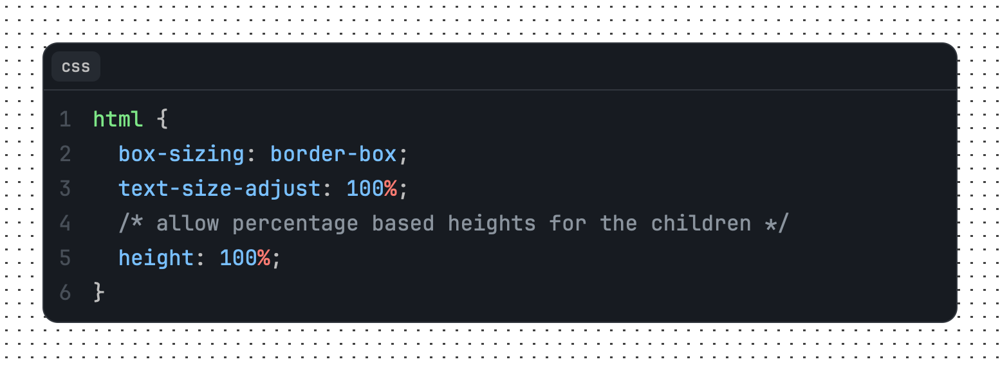

# rehype-starry-night

[](https://www.npmjs.com/package/@microflash/rehype-starry-night)
[](https://github.com/Microflash/rehype-starry-night/actions/workflows/regression.yml)
[](./LICENSE.md)

[rehype](https://github.com/rehypejs/rehype) plugin to highlight code with [Starry Night](https://github.com/wooorm/starry-night)

- [What’s this?](#whats-this)
- [When should I use this?](#when-should-i-use-this)
- [Install](#install)
- [Use](#use)
	- [Support for inline `code` elements](#support-for-inline-code-elements)
- [API](#api)
	- [Plugin API for `rehype-starry-night`](#plugin-api-for-rehype-starry-night)
	- [API for `rehype-starry-night-inline`](#api-for-rehype-starry-night-inline)
	- [API for `remark-inline-code-lang`](#api-for-remark-inline-code-lang)
- [Theming](#theming)
	- [Supporting Light and Dark themes](#supporting-light-and-dark-themes)
- [Examples](#examples)
	- [Example: single line codeblock](#example-single-line-codeblock)
	- [Example: line numbers for multiline codeblock](#example-line-numbers-for-multiline-codeblock)
	- [Example: show prompts](#example-show-prompts)
	- [Example: highlight lines](#example-highlight-lines)
	- [Example: codeblock with a caption](#example-codeblock-with-a-caption)
	- [Example: aliases](#example-aliases)
	- [Example: custom header extension](#example-custom-header-extension)
	- [Example: custom classname prefix](#example-custom-classname-prefix)
	- [Example: custom marker](#example-custom-marker)
- [Related](#related)
- [License](#license)

## What’s this?

This package is a [unified](https://github.com/unifiedjs/unified) ([rehype](https://github.com/rehypejs/rehype)) plugin to highlight code with [Starry Night](https://github.com/wooorm/starry-night) in a markdown document. It mimics GitHub's syntax highlighting.

## When should I use this?

This project is useful if you want to use the syntax highlighting powered by VS Code's syntax highlighter engine, and themes similar to GitHub. It is also useful if you want to build your own syntax highlighting themes based on [CSS custom properties](https://developer.mozilla.org/en-US/docs/Web/CSS/Using_CSS_custom_properties).

The following additonal features are also available out of box:

- line numbers
- line highlights
- annotations for added and removed lines
- conditionally wrapping lines
- prompt character
- title and language information
- highlighting inline `code` elements

## Install

This package is [ESM only](https://gist.github.com/sindresorhus/a39789f98801d908bbc7ff3ecc99d99c).

In Node.js (version 16.0+), install with [npm](https://docs.npmjs.com/cli/install):

```sh
npm install @microflash/rehype-starry-night
```

In Deno, with [esm.sh](https://esm.sh/):

```js
import rehypeStarryNight from "https://esm.sh/@microflash/rehype-starry-night";
```

In browsers, with [esm.sh](https://esm.sh/):

```html
<script type="module">
  import rehypeStarryNight from "https://esm.sh/@microflash/rehype-starry-night?bundle";
</script>
```

## Use

Say we have the following file `example.md`:

	```css
	html {
	  box-sizing: border-box;
	  text-size-adjust: 100%;
	  /* allow percentage based heights for the children */
	  height: 100%;
	}
	```

And our module `example.js` looks as follows:

```js
import { unified } from "unified";
import remarkParse from "remark-parse";
import remarkRehype from "remark-rehype";
import rehypeStringify from "rehype-stringify";
import rehypeStarryNight from "@microflash/rehype-starry-night";

main();

async function main() {
  const file = await unified()
    .use(remarkParse)
    .use(remarkRehype, { allowDangerousHtml: true })
    .use(rehypeStarryNight)
    .use(rehypeStringify, { allowDangerousHtml: true })
    .process(markdown);

  console.log(String(file));
}
```

Running that with `node example.js` yields:

```html
<div class="hl hl-css">
  <div class="hl-header">
    <div class="hl-language">css</div>
  </div>
<pre id="MC4wNTYxMTQ4" style="--hl-line-number-gutter-factor: 1"><code tabindex="0"><span class="line"><span class="line-number" aria-hidden="true">1</span><span class="pl-ent">html</span> {</span>
<span class="line"><span class="line-number" aria-hidden="true">2</span>  <span class="pl-c1">box-sizing</span>: <span class="pl-c1">border-box</span>;</span>
<span class="line"><span class="line-number" aria-hidden="true">3</span>  <span class="pl-c1">text-size-adjust</span>: <span class="pl-c1">100</span><span class="pl-k">%</span>;</span>
<span class="line"><span class="line-number" aria-hidden="true">4</span>  <span class="pl-c">/* allow percentage based heights for the children */</span></span>
<span class="line"><span class="line-number" aria-hidden="true">5</span>  <span class="pl-c1">height</span>: <span class="pl-c1">100</span><span class="pl-k">%</span>;</span>
<span class="line"><span class="line-number" aria-hidden="true">6</span>}</span>
</code></pre>
</div>
```



### Support for inline `code` elements

To highlight inline `code` elements, import [`rehype-starry-night-inline`](./src/rehype-starry-night-inline/index.js) plugin. This plugin relies on the language information injected by the [`remark-inline-code-lang`](./src/remark-inline-code-lang/index.js) plugin.

Say we have the following file `example.md`:

```md
To print a greeting, use `js> console.log("Hello, world!");`. This code prints `Hello, world!` on the console window.
```

And our module `example.js` looks as follows:

```js
import { unified } from "unified";
import remarkParse from "remark-parse";
import remarkInlineCodeLang from "@microflash/rehype-starry-night/remark-inline-code-lang";
import remarkRehype from "remark-rehype";
import rehypeStringify from "rehype-stringify";
import rehypeStarryNightInline from "@microflash/rehype-starry-night/rehype-starry-night-inline";

main();

async function main() {
  const file = await unified()
    .use(remarkParse)
    .use(remarkInlineCodeLang)
    .use(remarkRehype, { allowDangerousHtml: true })
    .use(rehypeStarryNightInline)
    .use(rehypeStringify, { allowDangerousHtml: true })
    .process(markdown);

  console.log(String(file));
}
```

Running that with `node example.js` yields:

```html
<p>To print a greeting, use <code class="hl-inline hl-js"><span class="pl-en">console</span>.<span class="pl-c1">log</span>(<span class="pl-s"><span class="pl-pds">"</span>Hello, world!<span class="pl-pds">"</span></span>);</code>. This code prints <code>Hello, world!</code> on the console window.</p>
```


## API

The default export is `rehypeStarryNight`. The following options are available. All of them are optional.

- `aliases` (type: `Object`) - used to alias languages to force syntax highlighting. By default, unknown languages are highlighted as plain text.
- `grammars` (type: `Array<Grammar>`) - array of [Starry Night](https://github.com/wooorm/starry-night) compatible grammar definitions. By default, all grammars provided by Starry Night are used.
- `classNamePrefix` (type: `string`, default: `hl`) - prefix of the classNames for different elements of HTML generated by the plugin.
- `plugins` (type: `Array<Plugin>`, default: [`defaultPluginPack`](./src/rehype-starry-night/index.js#L20)) - a list of plugins to customize the header and lines.

### Plugin API for `rehype-starry-night`

`rehype-starry-night` supports two types of plugins: _header plugins_ that modify the header items, and _line plugins_ that modify the lines of code.

```js
// structure of a plugin
export default {
  type: "header", // or "line"
  plugin: function (globalOptions, nodes) {
    // do something with `globalOptions` and `nodes`
  }
}
```

- `type` (type: `string`) - declares whether the plugin is a header or line plugin using `header` or `line` value.
- `globalOptions` (type: `Object`) - contains the configuration available to a plugin, such as
  - `id` (type: `string`) - unique id attached to the `pre` element
  - `metadata` (type: `Object`) - configuration specified on the codeblock, parsed with [`fenceparser`](https://github.com/Microflash/fenceparser)
  - `language` (type: `string`) - language specified on the codeblock after backticks
  - `classNamePrefix` (type: `string`, default: `hl`) - prefix of the classNames for different elements of HTML generated by the plugin
- `nodes` (type: `Array<Node>`) - array of [hast](https://github.com/syntax-tree/hastscript) nodes. For header plugins, it is the array of children of the header. For line plugins, it is the array of the lines of code in the codeblock.

`rehype-starry-night` ships with the following plugins out of box.

- [`headerLanguagePlugin`](./src/rehype-starry-night/plugins/header-language-plugin.js) - attaches the language in the header
- [`headerTitlePlugin`](./src/rehype-starry-night/plugins/header-title-plugin.js) - attaches a title in the header if specified on the codeblock
- [`linePromptPlugin`](./src/rehype-starry-night/plugins/line-prompt-plugin.js) - used to add a prompt symbol before the start of a line
- [`lineMarkPlugin`](./src/rehype-starry-night/plugins/line-mark-plugin.js) - used to highlight a line
- [`lineInsPlugin`](./src/rehype-starry-night/plugins/line-ins-plugin.js) - used to annotate an added line
- [`lineDelPlugin`](./src/rehype-starry-night/plugins/line-del-plugin.js) - used to annotate a removed line

### API for `rehype-starry-night-inline`

The following options are available for the `rehype-starry-night-inline` plugin. All of them are optional.

- `aliases` (type: `Object`) - used to alias languages to force syntax highlighting. By default, unknown languages are highlighted as plain text.
- `grammars` (type: `Array<Grammar>`): array of [Starry Night](https://github.com/wooorm/starry-night) compatible grammar definitions. By default, all grammars provided by Starry Night are used.
- `classNamePrefix` (type: `string`, default: `hl`): prefix of the classNames for different elements of HTML generated by the plugin.

### API for `remark-inline-code-lang`

The following options are available for the `remark-inline-code-lang` plugin. All of them are optional.

- `marker` (type: `string`, default: `> `) - the marker for inline `code` element before which the language information is specified.

## Theming

Import [`props.css`](./src/props.css) and [`index.css`](./src/index.css) files in your project, or use them as a base for your own custom theme. For different color schemes for syntax highlighting, check the [available themes on Starry Night repository](https://github.com/wooorm/starry-night#css).

### Supporting Light and Dark themes

Here's one way to support light and dark themes; the appropriate theme will get activated based on system preferences.

```css
:root {
  /* light theme variables specific to rehype-starry-night plugin */
  --hl-background-color: hsl(220, 23%, 97%);
  --hl-border-color: hsl(215, 15%, 85%);
  --hl-outline-color: hsl(215, 15%, 70%, 0.5);
  --hl-line-highlight-background-color: hsl(220, 23%, 92%);
  --hl-line-added-background-color: hsla(103, 96%, 73%, 0.5);
  --hl-line-removed-background-color: hsla(4, 75%, 83%, 0.5);
  --hl-line-active-background-color: hsl(220, 23%, 89%);
  --hl-line-number-added-color: hsl(106, 59%, 27%);
  --hl-line-number-removed-color: hsl(355, 67%, 41%);
}

@media (prefers-color-scheme: dark) {
  :root {
    /* dark theme variables specific to rehype-starry-night plugin */
    --hl-background-color: hsl(216, 18%, 11%);
    --hl-border-color: hsl(215, 11%, 22%);
    --hl-outline-color: hsl(215, 11%, 37%, 0.5);
    --hl-line-highlight-background-color: hsl(218, 14%, 17%);
    --hl-line-added-background-color: hsla(105, 62%, 20%, 0.5);
    --hl-line-removed-background-color: hsla(356, 69%, 31%, 0.5);
    --hl-line-active-background-color: hsl(218, 14%, 20%);
    --hl-line-number-added-color: hsl(105, 51%, 51%);
    --hl-line-number-removed-color: hsl(3, 77%, 74%);
  }
}

/* import a Starry Night theme that supports both dark and light themes */
@import "https://raw.githubusercontent.com/wooorm/starry-night/main/style/both.css";

/* import CSS specific to rehype-starry-night plugin */
@import "https://raw.githubusercontent.com/Microflash/rehype-starry-night/main/src/index.css";
```

> [!WARNING]
> URL imports for external styles is not recommended. You should either self-host them, bundle them, or copy-paste the entire CSS in one single file.

## Examples

### Example: single line codeblock

	```sh
	docker ps -a
	```

The above codeblock will yield:

```html
<div class="hl hl-sh">
  <div class="hl-header">
    <div class="hl-language">sh</div>
  </div>
<pre id="MC4zNzExNzQw"><code tabindex="0"><span class="line">docker ps -a</span>
</code></pre>
</div>
```


### Example: line numbers for multiline codeblock

	```css
	* {
	  display: revert;
	}
	```

The above codeblock will yield:

```html
<div class="hl hl-css">
  <div class="hl-header">
    <div class="hl-language">css</div>
  </div>
<pre id="MC4wMTQ1Nzg4"><code tabindex="0"><span class="line"><span class="line-number" aria-hidden="true">1</span><span class="pl-ent">*</span> {</span>
<span class="line"><span class="line-number" aria-hidden="true">2</span>  <span class="pl-c1">display</span>: <span class="pl-c1">revert</span>;</span>
<span class="line"><span class="line-number" aria-hidden="true">3</span>}</span>
</code></pre>
</div>
```


Line numbers are automatically padded to ensure that they are aligned properly.

### Example: show prompts

Sometimes you may want to show a prompt while displaying a command-line instruction. Prompts on multiple lines can be specified as follows.

	```sh prompt{1,3}
	curl localhost:8080/actuator/health
	{"status":"UP"}
	curl localhost:8080/greeter?name=Anya
	Hello, Anya!
	```

The above codeblock will yield:

```html
<div class="hl hl-sh">
  <div class="hl-header">
    <div class="hl-language">sh</div>
  </div>
<pre id="MC44MTg4MTA0"><code tabindex="0"><span class="line"><span class="line-number" aria-hidden="true">1</span><span class="line-prompt" aria-hidden="true"></span>curl localhost:8080/actuator/health</span>
<span class="line"><span class="line-number" aria-hidden="true">2</span>{<span class="pl-s"><span class="pl-pds">"</span>status<span class="pl-pds">"</span></span>:<span class="pl-s"><span class="pl-pds">"</span>UP<span class="pl-pds">"</span></span>}</span>
<span class="line"><span class="line-number" aria-hidden="true">3</span><span class="line-prompt" aria-hidden="true"></span>curl localhost:8080/greeter<span class="pl-k">?</span>name=Anya</span>
<span class="line"><span class="line-number" aria-hidden="true">4</span>Hello, Anya<span class="pl-k">!</span></span>
</code></pre>
</div>
```


[index.css](./src/index.css) disables user-selection of prompts to make sure that when a user copies the content of a codeblock, the prompt is not copied.

### Example: highlight lines

You can highlight multiple lines by specifying the line numbers (or even, range of line numbers) between curly braces in the codeblock metadata.

	```sh {4..7} prompt{1}
	aws --endpoint-url http://localhost:4566 s3api list-buckets
	{
	  "Buckets": [
	    {
	      "Name": "my-bucket",
	      "CreationDate": "2022-07-12T13:44:44+00:00"
	    }
	  ],
	  "Owner": {
	    "DisplayName": "webfile",
	    "ID": "bcaf1ffd86f41161ca5fb16fd081034f"
	  }
	}
	```

The above codeblock will yield:

```html
<div class="hl hl-sh">
  <div class="hl-header">
    <div class="hl-language">sh</div>
  </div>
<pre id="MC44MTc0NjQ5"><code tabindex="0"><span class="line"><span class="line-number" aria-hidden="true"> 1</span><span class="line-prompt" aria-hidden="true"></span>aws --endpoint-url http://localhost:4566 s3api list-buckets</span>
<span class="line"><span class="line-number" aria-hidden="true"> 2</span>{</span>
<span class="line"><span class="line-number" aria-hidden="true"> 3</span>  <span class="pl-s"><span class="pl-pds">"</span>Buckets<span class="pl-pds">"</span></span>: [</span>
<span class="line" data-highlighted><span class="line-number" aria-hidden="true"> 4</span>    {</span>
<span class="line" data-highlighted><span class="line-number" aria-hidden="true"> 5</span>      <span class="pl-s"><span class="pl-pds">"</span>Name<span class="pl-pds">"</span></span>: <span class="pl-s"><span class="pl-pds">"</span>my-bucket<span class="pl-pds">"</span></span>,</span>
<span class="line" data-highlighted><span class="line-number" aria-hidden="true"> 6</span>      <span class="pl-s"><span class="pl-pds">"</span>CreationDate<span class="pl-pds">"</span></span>: <span class="pl-s"><span class="pl-pds">"</span>2022-07-12T13:44:44+00:00<span class="pl-pds">"</span></span></span>
<span class="line" data-highlighted><span class="line-number" aria-hidden="true"> 7</span>    }</span>
<span class="line"><span class="line-number" aria-hidden="true"> 8</span>  ],</span>
<span class="line"><span class="line-number" aria-hidden="true"> 9</span>  <span class="pl-s"><span class="pl-pds">"</span>Owner<span class="pl-pds">"</span></span>: {</span>
<span class="line"><span class="line-number" aria-hidden="true">10</span>    <span class="pl-s"><span class="pl-pds">"</span>DisplayName<span class="pl-pds">"</span></span>: <span class="pl-s"><span class="pl-pds">"</span>webfile<span class="pl-pds">"</span></span>,</span>
<span class="line"><span class="line-number" aria-hidden="true">11</span>    <span class="pl-s"><span class="pl-pds">"</span>ID<span class="pl-pds">"</span></span>: <span class="pl-s"><span class="pl-pds">"</span>bcaf1ffd86f41161ca5fb16fd081034f<span class="pl-pds">"</span></span></span>
<span class="line"><span class="line-number" aria-hidden="true">12</span>  }</span>
<span class="line"><span class="line-number" aria-hidden="true">13</span>}</span>
</code></pre>
</div>
```


Refer to the documentation of [fenceparser](https://github.com/Microflash/fenceparser) to learn about the additional ways in which you can specify the information about highlighted lines.

### Example: codeblock with a caption

Captions are useful to describe the context of a piece of code.

	```sh caption='Configuring the AWS account' prompt{1}
	aws configure
	AWS Access Key ID [None]: gwen
	AWS Secret Access Key [None]: stacy
	Default region name [None]: us-east-1
	Default output format [None]: json
	```

The above codeblock will yield:

```html
<div class="hl hl-sh">
  <div class="hl-header">
    <div class="hl-language">sh</div>
    <div class="hl-caption">Configuring the AWS account</div>
  </div>
<pre id="MC45ODEyODAy"><code tabindex="0"><span class="line"><span class="line-number" aria-hidden="true">1</span><span class="line-prompt" aria-hidden="true"></span>aws configure</span>
<span class="line"><span class="line-number" aria-hidden="true">2</span>AWS Access Key ID [None]: gwen</span>
<span class="line"><span class="line-number" aria-hidden="true">3</span>AWS Secret Access Key [None]: stacy</span>
<span class="line"><span class="line-number" aria-hidden="true">4</span>Default region name [None]: us-east-1</span>
<span class="line"><span class="line-number" aria-hidden="true">5</span>Default output format [None]: json</span>
</code></pre>
</div>
```


### Example: aliases

Although Starry Night [supports](https://github.com/wooorm/starry-night#languages=) a large number of languages, it is not all encompassing. In such cases, you can configure aliases to force the syntax highlighting on a codeblock containing code in a language not yet supported by Starry Night.

Say we have the following file `example.md`:

	```xjm
	language = "en"
	customization = false
	features = [ "io", "graphics", "compute" ]
	```

You can alias `xjm` to `toml` as follows with `example.js`:

```js
import { unified } from "unified";
import remarkParse from "remark-parse";
import remarkRehype from "remark-rehype";
import rehypeStringify from "rehype-stringify";
import rehypeStarryNight from "https://esm.sh/@microflash/rehype-starry-night";

main()

async function main() {
  const file = await unified()
    .use(remarkParse)
    .use(remarkRehype, { allowDangerousHtml: true })
    .use(rehypeStarryNight, { aliases: { xjm: "toml" } })
    .use(rehypeStringify, { allowDangerousHtml: true })
    .process(markdown);

  console.log(String(file));
}
```

Running that with `node example.js` yields:

```html
<div class="hl hl-toml">
  <div class="hl-header">
    <div class="hl-language">xjm</div>
  </div>
<pre id="MC40OTE3NjA4"><code tabindex="0"><span class="line"><span class="line-number" aria-hidden="true">1</span><span class="pl-smi">language</span> = <span class="pl-s"><span class="pl-pds">"</span>en<span class="pl-pds">"</span></span></span>
<span class="line"><span class="line-number" aria-hidden="true">2</span><span class="pl-smi">customization</span> = <span class="pl-c1">false</span></span>
<span class="line"><span class="line-number" aria-hidden="true">3</span><span class="pl-smi">features</span> = [ <span class="pl-s"><span class="pl-pds">"</span>io<span class="pl-pds">"</span></span>, <span class="pl-s"><span class="pl-pds">"</span>graphics<span class="pl-pds">"</span></span>, <span class="pl-s"><span class="pl-pds">"</span>compute<span class="pl-pds">"</span></span> ]</span>
</code></pre>
</div>
```


### Example: custom header extension

Suppose you want to add a copy to clipboard button in the header. You can do so by adding a custom header extension.

Say we have the following file `example.md`:

	```html
	<mark>highlighted</mark>
	```

You can pass a custom header extension as follows with `example.js`:

```js
import { unified } from "unified";
import remarkParse from "remark-parse";
import remarkRehype from "remark-rehype";
import rehypeStringify from "rehype-stringify";
import rehypeStarryNight from "@microflash/rehype-starry-night";
import rehypeStarryNightHeaderCaptionExtension from "@microflash/rehype-starry-night/header-caption-extension";
import rehypeStarryNightHeaderLanguageExtension from "@microflash/rehype-starry-night/header-language-extension";

main()

async function main() {
  const file = await unified()
    .use(remarkParse)
    .use(remarkRehype, { allowDangerousHtml: true })
    .use(rehypeStarryNight, {
      headerExtensions: [
        rehypeStarryNightHeaderLanguageExtension,
        rehypeStarryNightHeaderCaptionExtension,
        (headerOptions, children) => {
          children.push({
            type: "element",
            tagName: "button",
            properties: { className: [`${headerOptions.classNamePrefix}-copy`], for: headerOptions.id },
            children: [
              {
                type: "text",
                value: "Copy"
              }
            ]
          })
        }
      ]
    })
    .use(rehypeStringify, { allowDangerousHtml: true })
    .process(markdown);

  console.log(String(file));
}
```

Running that with `node example.js` yields:

```html
<div class="hl hl-html">
  <div class="hl-header">
    <div class="hl-language">html</div>
    <button class="hl-copy" for="MC40MTUyMDQ4">Copy</button>
  </div>
<pre id="MC40MTUyMDQ4"><code tabindex="0"><span class="line">&lt;<span class="pl-ent">mark</span>&gt;highlighted&lt;/<span class="pl-ent">mark</span>&gt;</span>
</code></pre>
</div>
```


### Example: custom classname prefix

You can attach your own prefix on the classNames of HTML elements generated by the `rehype-starry-night` and `rehype-starry-night-inline` plugins.

Say we have the following file `example.md`:

	```java
	System.out.println("Hello, world!");
	```

You can customize the className prefix as follows with `example.js`:

```js
import { unified } from "unified";
import remarkParse from "remark-parse";
import remarkRehype from "remark-rehype";
import rehypeStringify from "rehype-stringify";
import rehypeStarryNight from "@microflash/rehype-starry-night";

main()

async function main() {
  const file = await unified()
    .use(remarkParse)
    .use(remarkRehype, { allowDangerousHtml: true })
    .use(rehypeStarryNight, { classNamePrefix: "syntax" })
    .use(rehypeStringify, { allowDangerousHtml: true })
    .process(markdown);

  console.log(String(file));
}
```

Running that with `node example.js` yields:

```html
<div class="syntax syntax-java">
  <div class="syntax-header">
    <div class="syntax-language">java</div>
  </div>
<pre id="MC42NjM4OTE0"><code tabindex="0"><span class="line"><span class="pl-smi">System</span><span class="pl-k">.</span>out<span class="pl-k">.</span>println(<span class="pl-s"><span class="pl-pds">"</span>Hello, world!<span class="pl-pds">"</span></span>);</span>
</code></pre>
</div>
```

Similarly for inline `code` element, say we have the following file `example.md`:

```md
To remove the whitespace around a string, try `java> str.strip()`.
```

You can customize the className prefix as follows with `example.js`:

```js
import { unified } from "unified";
import remarkParse from "remark-parse";
import remarkInlineCodeLang from "@microflash/rehype-starry-night/remark-inline-code-lang";
import remarkRehype from "remark-rehype";
import rehypeStringify from "rehype-stringify";
import rehypeStarryNightInline from "@microflash/rehype-starry-night/rehype-starry-night-inline";

main();

async function main() {
  const file = await unified()
    .use(remarkParse)
    .use(remarkInlineCodeLang)
    .use(remarkRehype, { allowDangerousHtml: true })
    .use(rehypeStarryNightInline, { classNamePrefix: "syntax" })
    .use(rehypeStringify, { allowDangerousHtml: true })
    .process(markdown);

  console.log(String(file));
}
```

Running that with `node example.js` yields:

```html
<p>To remove the whitespace around a string, try <code class="syntax-inline syntax-java">str<span class="pl-k">.</span>strip()</code>.</p>
```

### Example: custom marker

You can configure a custom marker for inline `code` element to inject the language information. For example, say you want to annotate your inline `code` element with `: ` instead of the default `> ` marker, as shown in the following file `example.md`:

```md
To specify the language direction, use `html: <span dir="rtl">مرحبا</span>`.
```

You can customize the marker as follows with `example.js`:

```js
import { unified } from "unified";
import remarkParse from "remark-parse";
import remarkInlineCodeLang from "@microflash/rehype-starry-night/remark-inline-code-lang";
import remarkRehype from "remark-rehype";
import rehypeStringify from "rehype-stringify";
import rehypeStarryNightInline from "@microflash/rehype-starry-night/rehype-starry-night-inline";

main();

async function main() {
  const file = await unified()
    .use(remarkParse)
    .use(remarkInlineCodeLang, { marker: ": " })
    .use(remarkRehype, { allowDangerousHtml: true })
    .use(rehypeStarryNightInline)
    .use(rehypeStringify, { allowDangerousHtml: true })
    .process(markdown);

  console.log(String(file));
}
```

Running that with `node example.js` yields:

```html
<p>To specify the language direction, use <code class="hl-inline hl-html">&lt;<span class="pl-ent">span</span> <span class="pl-e">dir</span>=<span class="pl-s"><span class="pl-pds">"</span>rtl<span class="pl-pds">"</span></span>&gt;مرحبا&lt;/<span class="pl-ent">span</span>&gt;</code>.</p>
```


## Related

- [`rehype-highlight`](https://github.com/rehypejs/rehype-highlight) &mdash; highlight code with [highlight.js](https://github.com/isagalaev/highlight.js) (through [lowlight](https://github.com/wooorm/lowlight))
- [`rehype-prism-plus`](https://github.com/timlrx/rehype-prism-plus) &mdash; highlight code with [Prism](http://prismjs.com) (via [refractor](https://github.com/wooorm/refractor)) with additional line highlighting and line numbers functionalities
- [`@shikijs/rehype`](https://github.com/shikijs/shiki/tree/main/packages/rehype) &mdash; highlight code with [shiki](https://shiki.style)

## License

[MIT](./LICENSE.md)
