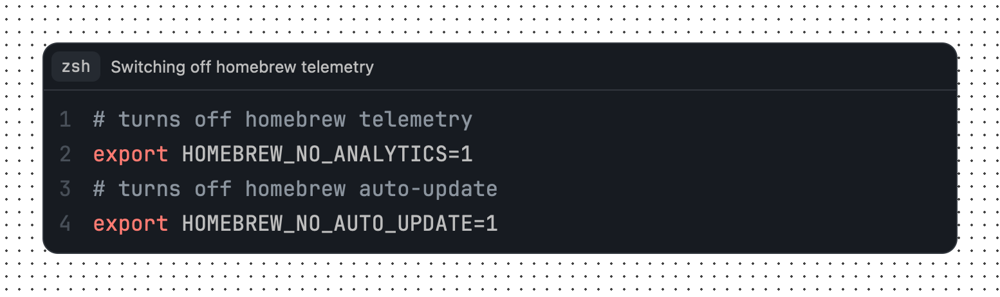
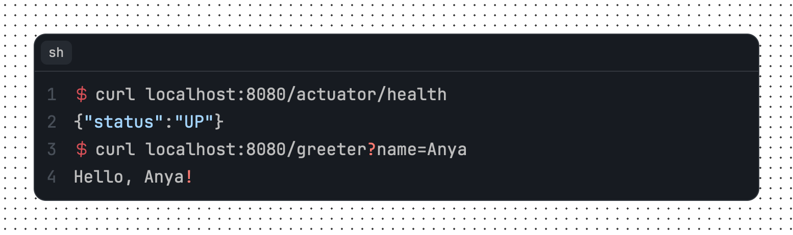

# rehype-starry-night

[](https://www.npmjs.com/package/@microflash/rehype-starry-night)
[](https://github.com/Microflash/rehype-starry-night/actions/workflows/regression.yml)
[](./LICENSE.md)

[rehype](https://github.com/rehypejs/rehype) plugin to highlight code with [Starry Night](https://github.com/wooorm/starry-night)

- [What’s this?](#whats-this)
- [When should I use this?](#when-should-i-use-this)
- [Install](#install)
- [Use](#use)
- [API](#api)
	- [Themes](#themes)
- [Examples](#examples)
	- [Example: single line codeblock](#example-single-line-codeblock)
	- [Example: line numbers for multiline codeblock](#example-line-numbers-for-multiline-codeblock)
	- [Example: show prompts](#example-show-prompts)
	- [Example: highlight lines](#example-highlight-lines)
	- [Example: add a caption to a codeblock](#example-add-a-caption-to-a-codeblock)
	- [Example: configure aliases](#example-configure-aliases)
	- [Example: custom header extension](#example-custom-header-extension)
- [Related](#related)
- [License](#license)

## What’s this?

This package is a [unified](https://github.com/unifiedjs/unified) ([rehype](https://github.com/rehypejs/rehype)) plugin to highlight code with [Starry Night](https://github.com/wooorm/starry-night) in a markdown document. This results into syntax highlighting like what GitHub uses to highlight code.

## When should I use this?

This project is useful if you want to use the syntax highlighting powered by VS Code syntax highlighter engine, and themes similar to GitHub. It is also useful if you want to build your own syntax highlighting themes based on [CSS custom properties](https://developer.mozilla.org/en-US/docs/Web/CSS/Using_CSS_custom_properties).

The following additonal features are also available:

- line numbers
- line highlights
- support for prompt
- captions and language information

## Install

This package is [ESM only](https://gist.github.com/sindresorhus/a39789f98801d908bbc7ff3ecc99d99c).

In Node.js (version 16.0+), install with [npm](https://docs.npmjs.com/cli/install):

```sh
npm install @microflash/rehype-starry-night
```

In Deno, with [esm.sh](https://esm.sh/):

```js
import rehypeStarryNight from "https://esm.sh/@microflash/rehype-starry-night"
```

In browsers, with [esm.sh](https://esm.sh/):

```html
<script type="module">
  import rehypeStarryNight from "https://esm.sh/@microflash/rehype-starry-night?bundle"
</script>
```

## Use

Say we have the following file `example.md`:

	```css
	html {
	  box-sizing: border-box;
	  text-size-adjust: 100%;
	  /* allow percentage based heights for the children */
	  height: 100%;
	}
	```

And our module `example.js` looks as follows:

```js
import { unified } from "unified"
import remarkParse from "remark-parse"
import remarkRehype from "remark-rehype"
import rehypeStringify from "rehype-stringify"
import rehypeStarryNight from "https://esm.sh/@microflash/rehype-starry-night"

main()

async function main() {
  const file = await unified()
    .use(remarkParse)
    .use(remarkRehype, { allowDangerousHtml: true })
    .use(rehypeStarryNight)
    .use(rehypeStringify, { allowDangerousHtml: true })
    .process(markdown)

  console.log(String(file))
}
```

Running that with `node example.js` yields:

```html
<div class="highlight highlight-css">
  <div class="highlight-header">
    <div class="highlight-language">css</div>
  </div>
<pre id="MC4zMzc4MTYx"><code tabindex="0"><span class="line"><span class="line-number" aria-hidden="true">1</span><span class="pl-ent">html</span> {</span>
<span class="line"><span class="line-number" aria-hidden="true">2</span>  <span class="pl-c1">box-sizing</span>: <span class="pl-c1">border-box</span>;</span>
<span class="line"><span class="line-number" aria-hidden="true">3</span>  <span class="pl-c1">text-size-adjust</span>: <span class="pl-c1">100</span><span class="pl-k">%</span>;</span>
<span class="line"><span class="line-number" aria-hidden="true">4</span>  <span class="pl-c">/* allow percentage based heights for the children */</span></span>
<span class="line"><span class="line-number" aria-hidden="true">5</span>  <span class="pl-c1">height</span>: <span class="pl-c1">100</span><span class="pl-k">%</span>;</span>
<span class="line"><span class="line-number" aria-hidden="true">6</span>}</span>
</code></pre>
</div>
```


## API

The default export is `rehypeStarryNight`. The following options are available. All of them are optional.

- `aliases`: an object to alias languages to force syntax highlighting. By default, unknown languages are highlighted as plain text.
- `grammars`: a list of [Starry Night](https://github.com/wooorm/starry-night) compatible grammar definitions. By default, all grammars provided by Starry Night are used.
- `headerExtensions`: a list of functions to customize the header. By default, [language-extension](./src/hast-util-starry-night-header-language-extension.js) and [caption-extension](./src/hast-util-starry-night-header-caption-extension.js) are used. A header extension has access to the following arguments.
  - `headerOptions`: an object with a randomly generated `id` attached to the `pre` element, `metadata` containing the caption, list of highlighted lines, etc., and `language` tag specified on the code
  - `children`: an array of nodes contained in the header

### Themes

Check out the [available themes on Starry Night repository](https://github.com/wooorm/starry-night#css).

Import [index.css](./src/index.css) or use it as a base for your own custom styles to style codeblock headers (containing language and captions) and gutters (providing line number, highlighting and prompt).

#### Supporting Light and Dark themes

There are multiple ways to support light and dark themes. Here's one way to do this; the appropriate theme will get activated based on system preferences.

```css
:root {
  /* light theme variables specific to rehype-starry-night plugin */
  --highlight-background-color: hsl(0, 0%, 100%);
  --highlight-border-color: hsl(208, 21%, 86%);
  --highlight-code-highlight: hsl(208, 19%, 82%);
}

@media (prefers-color-scheme: dark) {
  :root {
    /* dark theme variables specific to rehype-starry-night plugin */
    --highlight-background-color: hsl(240, 20%, 2%);
    --highlight-border-color: hsl(208, 21%, 12%);
    --highlight-code-highlight: hsl(208, 19%, 13%);
  }
}

/* import a Starry Night theme that supports both dark and light themes */
@import "https://raw.githubusercontent.com/wooorm/starry-night/main/style/both.css";

/* import CSS specific to rehype-starry-night plugin */
@import "https://raw.githubusercontent.com/Microflash/rehype-starry-night/main/index.css";
```

> [!WARNING]
> URL imports for external styles is not recommended. You should either self-host them, bundle them, or copy-paste the entire CSS in one single file.

## Examples

### Example: single line codeblock

	```sh
	docker ps -a
	```

The above codeblock will yield:

```html
<div class="highlight highlight-sh">
  <div class="highlight-header">
    <div class="highlight-language">sh</div>
  </div>
<pre id="MC40OTg1ODA0"><code tabindex="0"><span class="line">docker ps -a</span>
</code></pre>
</div>
```


### Example: line numbers for multiline codeblock

	```css
	* {
	  display: revert;
	}
	```

The above codeblock will yield:

```html
<div class="highlight highlight-css">
  <div class="highlight-header">
    <div class="highlight-language">css</div>
  </div>
<pre id="MC4yODM1ODY3"><code tabindex="0"><span class="line"><span class="line-number" aria-hidden="true">1</span><span class="pl-ent">*</span> {</span>
<span class="line"><span class="line-number" aria-hidden="true">2</span>  <span class="pl-c1">display</span>: <span class="pl-c1">revert</span>;</span>
<span class="line"><span class="line-number" aria-hidden="true">3</span>}</span>
</code></pre>
</div>
```


Line numbers are automatically padded to ensure that they are aligned properly.

### Example: show prompts

Sometimes you may want to show a prompt while displaying a command-line instruction. Prompts on multiple lines can be specified as follows.

	```sh prompt{1,3}
	curl localhost:8080/actuator/health
	{"status":"UP"}
	curl localhost:8080/greeter?name=Anya
	Hello, Anya!
	```

The above codeblock will yield:

```html
<div class="highlight highlight-sh">
  <div class="highlight-header">
    <div class="highlight-language">sh</div>
  </div>
<pre id="MC4zMDQ2MjUy"><code tabindex="0"><span class="line"><span class="line-number" aria-hidden="true">1</span><span class="line-prompt" aria-hidden="true"></span>curl localhost:8080/actuator/health</span>
<span class="line"><span class="line-number" aria-hidden="true">2</span>{<span class="pl-s"><span class="pl-pds">"</span>status<span class="pl-pds">"</span></span>:<span class="pl-s"><span class="pl-pds">"</span>UP<span class="pl-pds">"</span></span>}</span>
<span class="line"><span class="line-number" aria-hidden="true">3</span><span class="line-prompt" aria-hidden="true"></span>curl localhost:8080/greeter<span class="pl-k">?</span>name=Anya</span>
<span class="line"><span class="line-number" aria-hidden="true">4</span>Hello, Anya<span class="pl-k">!</span></span>
</code></pre>
</div>
```


[index.css](./src/index.css) disables user-selection of prompts to make sure that when a user copies the content of a codeblock, the prompt is not copied.

### Example: highlight lines

You can highlight multiple lines by specifying the line numbers (or even, range of line numbers) between curly braces in the codeblock metadata.

	```sh {4-7} prompt{1}
	aws --endpoint-url http://localhost:4566 s3api list-buckets
	{
	  "Buckets": [
	    {
	      "Name": "my-bucket",
	      "CreationDate": "2022-07-12T13:44:44+00:00"
	    }
	  ],
	  "Owner": {
	    "DisplayName": "webfile",
	    "ID": "bcaf1ffd86f41161ca5fb16fd081034f"
	  }
	}
	```

The above codeblock will yield:

```html
<div class="highlight highlight-sh">
  <div class="highlight-header">
    <div class="highlight-language">sh</div>
  </div>
<pre id="MC44MTc0Njk1"><code tabindex="0"><span class="line"><span class="line-number" aria-hidden="true"> 1</span><span class="line-prompt" aria-hidden="true"></span>aws --endpoint-url http://localhost:4566 s3api list-buckets</span>
<span class="line"><span class="line-number" aria-hidden="true"> 2</span>{</span>
<span class="line"><span class="line-number" aria-hidden="true"> 3</span>  <span class="pl-s"><span class="pl-pds">"</span>Buckets<span class="pl-pds">"</span></span>: [</span>
<span class="line" data-highlighted><span class="line-number" aria-hidden="true"> 4</span>    {</span>
<span class="line" data-highlighted><span class="line-number" aria-hidden="true"> 5</span>      <span class="pl-s"><span class="pl-pds">"</span>Name<span class="pl-pds">"</span></span>: <span class="pl-s"><span class="pl-pds">"</span>my-bucket<span class="pl-pds">"</span></span>,</span>
<span class="line" data-highlighted><span class="line-number" aria-hidden="true"> 6</span>      <span class="pl-s"><span class="pl-pds">"</span>CreationDate<span class="pl-pds">"</span></span>: <span class="pl-s"><span class="pl-pds">"</span>2022-07-12T13:44:44+00:00<span class="pl-pds">"</span></span></span>
<span class="line" data-highlighted><span class="line-number" aria-hidden="true"> 7</span>    }</span>
<span class="line"><span class="line-number" aria-hidden="true"> 8</span>  ],</span>
<span class="line"><span class="line-number" aria-hidden="true"> 9</span>  <span class="pl-s"><span class="pl-pds">"</span>Owner<span class="pl-pds">"</span></span>: {</span>
<span class="line"><span class="line-number" aria-hidden="true">10</span>    <span class="pl-s"><span class="pl-pds">"</span>DisplayName<span class="pl-pds">"</span></span>: <span class="pl-s"><span class="pl-pds">"</span>webfile<span class="pl-pds">"</span></span>,</span>
<span class="line"><span class="line-number" aria-hidden="true">11</span>    <span class="pl-s"><span class="pl-pds">"</span>ID<span class="pl-pds">"</span></span>: <span class="pl-s"><span class="pl-pds">"</span>bcaf1ffd86f41161ca5fb16fd081034f<span class="pl-pds">"</span></span></span>
<span class="line"><span class="line-number" aria-hidden="true">12</span>  }</span>
<span class="line"><span class="line-number" aria-hidden="true">13</span>}</span>
</code></pre>
</div>
```



Refer to the documentation of [fenceparser](https://github.com/Microflash/fenceparser) to learn about the additional ways in which you can specify the information about highlighted lines.

### Example: add a caption to a codeblock

Captions are useful to describe the context of a piece of code.

	```sh caption='Configuring the AWS account' prompt{1}
	aws configure
	AWS Access Key ID [None]: gwen
	AWS Secret Access Key [None]: stacy
	Default region name [None]: us-east-1
	Default output format [None]: json
	```

The above codeblock will yield:

```html
<div class="highlight highlight-sh">
  <div class="highlight-header">
    <div class="highlight-language">sh</div>
    <div class="highlight-caption">Configuring the AWS account</div>
  </div>
<pre id="MC40NTMzMDQx"><code tabindex="0"><span class="line"><span class="line-number" aria-hidden="true">1</span><span class="line-prompt" aria-hidden="true"></span>aws configure</span>
<span class="line"><span class="line-number" aria-hidden="true">2</span>AWS Access Key ID [None]: gwen</span>
<span class="line"><span class="line-number" aria-hidden="true">3</span>AWS Secret Access Key [None]: stacy</span>
<span class="line"><span class="line-number" aria-hidden="true">4</span>Default region name [None]: us-east-1</span>
<span class="line"><span class="line-number" aria-hidden="true">5</span>Default output format [None]: json</span>
</code></pre>
</div>
```



### Example: configure aliases

Although Starry Night [supports](https://github.com/wooorm/starry-night#languages=) a huge number of languages, it is not all encompassing. In such cases, you can configure aliases to force syntax highlighting a codeblock containing code in a language not yet supported by Starry Night.

Say we have the following file `example.md`:

	```xjm
	language = "en"
	customization = false
	features = [ "io", "graphics", "compute" ]
	```

You can alias `xjm` to `toml` as follows with `example.js`:

```js
import { unified } from "unified"
import remarkParse from "remark-parse"
import remarkRehype from "remark-rehype"
import rehypeStringify from "rehype-stringify"
import rehypeStarryNight from "https://esm.sh/@microflash/rehype-starry-night"

main()

async function main() {
  const file = await unified()
    .use(remarkParse)
    .use(remarkRehype, { allowDangerousHtml: true })
    .use(rehypeStarryNight, { aliases: { xjm: "toml" } })
    .use(rehypeStringify, { allowDangerousHtml: true })
    .process(markdown)

  console.log(String(file))
}
```

Running that with `node example.js` yields:

```html
<div class="highlight highlight-toml">
  <div class="highlight-header">
    <div class="highlight-language">xjm</div>
  </div>
<pre id="MC41Nzk3ODE2"><code tabindex="0"><span class="line"><span class="line-number" aria-hidden="true">1</span><span class="pl-smi">language</span> = <span class="pl-s"><span class="pl-pds">"</span>en<span class="pl-pds">"</span></span></span>
<span class="line"><span class="line-number" aria-hidden="true">2</span><span class="pl-smi">customization</span> = <span class="pl-c1">false</span></span>
<span class="line"><span class="line-number" aria-hidden="true">3</span><span class="pl-smi">features</span> = [ <span class="pl-s"><span class="pl-pds">"</span>io<span class="pl-pds">"</span></span>, <span class="pl-s"><span class="pl-pds">"</span>graphics<span class="pl-pds">"</span></span>, <span class="pl-s"><span class="pl-pds">"</span>compute<span class="pl-pds">"</span></span> ]</span>
</code></pre>
</div>
```


### Example: custom header extension

Suppose you want to add a copy to clipboard button in the header. You can do so by adding a custom header extension.

Say we have the following file `example.md`:

	```html
	<mark>highlighted</mark>
	```

You can pass a custom header extension as follows with `example.js`:

```js
import { unified } from "unified"
import remarkParse from "remark-parse"
import remarkRehype from "remark-rehype"
import rehypeStringify from "rehype-stringify"
import rehypeStarryNight from "https://esm.sh/@microflash/rehype-starry-night"
import rehypeStarryNightHeaderCaptionExtension from "@microflash/rehype-starry-night/header-caption-extension"
import rehypeStarryNightHeaderLanguageExtension from "@microflash/rehype-starry-night/header-language-extension"

main()

async function main() {
  const file = await unified()
    .use(remarkParse)
    .use(remarkRehype, { allowDangerousHtml: true })
    .use(rehypeStarryNight, {
      headerExtensions: [
        rehypeStarryNightHeaderLanguageExtension,
        rehypeStarryNightHeaderCaptionExtension,
        (headerOptions, children) => {
          children.push({
            type: "element",
            tagName: "button",
            properties: { className: ["highlight-copy"], for: headerOptions.id },
            children: [
              {
                type: "text",
                value: "Copy"
              }
            ]
          })
        }
      ]
    })
    .use(rehypeStringify, { allowDangerousHtml: true })
    .process(markdown)

  console.log(String(file))
}
```

Running that with `node example.js` yields:

```html
<div class="highlight highlight-html">
  <div class="highlight-header">
    <div class="highlight-language">html</div>
    <button class="highlight-copy" for="MC41MTc4MjIz">Copy</button>
  </div>
<pre id="MC41MTc4MjIz"><code tabindex="0"><span class="line">&lt;<span class="pl-ent">mark</span>&gt;highlighted&lt;/<span class="pl-ent">mark</span>&gt;</span>
</code></pre>
</div>
```

## Related

- [`rehype-highlight`](https://github.com/rehypejs/rehype-highlight) &mdash; highlight code with [highlight.js](https://github.com/isagalaev/highlight.js) (through [lowlight](https://github.com/wooorm/lowlight))
- [`rehype-prism`](https://github.com/mapbox/rehype-prism) &mdash; highlight code with [Prism](http://prismjs.com) (via [refractor](https://github.com/wooorm/refractor))
- [`rehype-prism-plus`](https://github.com/timlrx/rehype-prism-plus) &mdash; highlight code with [Prism](http://prismjs.com) (via [refractor](https://github.com/wooorm/refractor)) with additional line highlighting and line numbers functionalities
- [`rehype-shiki`](https://github.com/rsclarke/rehype-shiki) &mdash; highlight code with [shiki](https://github.com/octref/shiki)

## License

[MIT](./LICENSE.md)
